# Use Case Diagram - Platform Administrator Context

## Purpose
Complete administrative use case diagram covering platform governance, user management, dispute resolution, system monitoring, and operational oversight.

## Scope
- Supplier verification and approval workflows
- User account management and moderation
- Dispute resolution and mediation
- Category and taxonomy management
- Platform analytics and monitoring
- System configuration and maintenance

## PlantUML Diagram

```plantuml
@startuml use_case_admin_context
!define ADMIN_COLOR #FFECB3
!define SYSTEM_COLOR #E3F2FD
!define EXTERNAL_COLOR #FFCDD2

skinparam actorStyle awesome
skinparam packageStyle rectangle

actor "Platform Admin" as Admin
actor "Super Admin" as SuperAdmin
actor "Supplier" as Supplier <<secondary>>
actor "Shop" as Shop <<secondary>>
actor "Monitoring Service" as Monitoring <<external>>
actor "Email Service" as EmailSvc <<external>>

rectangle "Platform Administration System" as AdminSystem {
  
  package "Supplier Verification & Onboarding" as VerificationPkg <<ADMIN_COLOR>> {
    usecase "Review Supplier Applications" as UC_ReviewApplications
    usecase "Verify Business Documents" as UC_VerifyDocs
    usecase "Check Tax Compliance" as UC_CheckTax
    usecase "Validate Certifications" as UC_ValidateCerts
    usecase "Conduct Background Check" as UC_BackgroundCheck
    usecase "Approve Supplier" as UC_ApproveSupplier
    usecase "Reject Supplier" as UC_RejectSupplier
    usecase "Request Additional Documents" as UC_RequestDocs
    usecase "Flag Suspicious Application" as UC_FlagSuspicious
    usecase "Re-verify Existing Supplier" as UC_Reverify
  }
  
  package "User Account Management" as UserMgmtPkg <<ADMIN_COLOR>> {
    usecase "View All Users" as UC_ViewUsers
    usecase "Search User Accounts" as UC_SearchUsers
    usecase "View User Activity Log" as UC_ViewActivityLog
    usecase "Suspend User Account" as UC_SuspendUser
    usecase "Reactivate User Account" as UC_ReactivateUser
    usecase "Ban User Permanently" as UC_BanUser
    usecase "Reset User Password" as UC_ResetPassword
    usecase "Modify User Permissions" as UC_ModifyPermissions
    usecase "Merge Duplicate Accounts" as UC_MergeDuplicates
    usecase "Delete User Data (GDPR)" as UC_DeleteUserData
  }
  
  package "Content Moderation" as ModerationPkg <<ADMIN_COLOR>> {
    usecase "Review Flagged Products" as UC_ReviewProducts
    usecase "Remove Inappropriate Content" as UC_RemoveContent
    usecase "Verify Product Claims" as UC_VerifyClaims
    usecase "Monitor Pricing Anomalies" as UC_MonitorPricing
    usecase "Review User Reviews" as UC_ReviewReviews
    usecase "Handle Spam Reports" as UC_HandleSpam
  }
  
  package "Dispute Resolution" as DisputePkg <<ADMIN_COLOR>> {
    usecase "View Open Disputes" as UC_ViewDisputes
    usecase "Investigate Dispute" as UC_InvestigateDispute
    usecase "Request Evidence from Parties" as UC_RequestEvidence
    usecase "Review Negotiation History" as UC_ReviewNegoHistory
    usecase "Mediate Between Parties" as UC_Mediate
    usecase "Issue Ruling" as UC_IssueRuling
    usecase "Enforce Resolution" as UC_EnforceResolution
    usecase "Escalate to Legal" as UC_EscalateLegal
    usecase "Close Dispute" as UC_CloseDispute
  }
  
  package "Category & Taxonomy Management" as TaxonomyPkg <<ADMIN_COLOR>> {
    usecase "Create Product Category" as UC_CreateCategory
    usecase "Edit Category Details" as UC_EditCategory
    usecase "Delete Category" as UC_DeleteCategory
    usecase "Reorganize Category Hierarchy" as UC_ReorganizeHierarchy
    usecase "Merge Categories" as UC_MergeCategories
    usecase "Set Category Attributes" as UC_SetAttributes
    usecase "Manage Category Icons" as UC_ManageIcons
    usecase "Review Category Usage Stats" as UC_ReviewCategoryStats
  }
  
  package "Platform Analytics & Reporting" as AnalyticsPkg <<ADMIN_COLOR>> {
    usecase "View Dashboard Overview" as UC_ViewDashboard
    usecase "Generate User Growth Report" as UC_GenerateUserReport
    usecase "Analyze Transaction Volume" as UC_AnalyzeTransactions
    usecase "Track Negotiation Success Rate" as UC_TrackSuccess
    usecase "Monitor Platform Health" as UC_MonitorHealth
    usecase "Export Analytics Data" as UC_ExportAnalytics
    usecase "View Revenue Metrics" as UC_ViewRevenue
    usecase "Analyze Supplier Performance" as UC_AnalyzeSupplierPerf
    usecase "Track Shop Engagement" as UC_TrackEngagement
  }
  
  package "System Configuration" as ConfigPkg <<ADMIN_COLOR>> {
    usecase "Manage System Settings" as UC_ManageSettings
    usecase "Configure Email Templates" as UC_ConfigEmailTemplates
    usecase "Set Business Rules" as UC_SetBusinessRules
    usecase "Manage Feature Flags" as UC_ManageFeatureFlags
    usecase "Configure Payment Thresholds" as UC_ConfigThresholds
    usecase "Set Rate Limits" as UC_SetRateLimits
    usecase "Manage API Keys" as UC_ManageAPIKeys
  }
  
  package "Audit & Compliance" as AuditPkg <<ADMIN_COLOR>> {
    usecase "View Audit Logs" as UC_ViewAuditLogs
    usecase "Search Admin Actions" as UC_SearchActions
    usecase "Generate Compliance Report" as UC_GenerateCompliance
    usecase "Export User Data" as UC_ExportUserData
    usecase "Review Data Access Logs" as UC_ReviewAccessLogs
    usecase "Verify GDPR Compliance" as UC_VerifyGDPR
  }
  
  package "Notifications & Alerts" as NotificationPkg <<ADMIN_COLOR>> {
    usecase "Send Platform Announcement" as UC_SendAnnouncement
    usecase "Send Targeted Notification" as UC_SendTargeted
    usecase "Schedule Maintenance Alert" as UC_ScheduleMaintenance
    usecase "Broadcast Emergency Alert" as UC_BroadcastEmergency
  }
  
  package "Support & Help Desk" as SupportPkg <<ADMIN_COLOR>> {
    usecase "View Support Tickets" as UC_ViewTickets
    usecase "Respond to User Query" as UC_RespondQuery
    usecase "Escalate Complex Issue" as UC_EscalateIssue
    usecase "Access User Account for Support" as UC_AccessForSupport
    usecase "Create Knowledge Base Article" as UC_CreateKBArticle
  }
}

' Admin relationships
Admin --> UC_ReviewApplications
Admin --> UC_VerifyDocs
Admin --> UC_ApproveSupplier
Admin --> UC_RejectSupplier
Admin --> UC_ViewUsers
Admin --> UC_SuspendUser
Admin --> UC_ViewDisputes
Admin --> UC_InvestigateDispute
Admin --> UC_Mediate
Admin --> UC_CreateCategory
Admin --> UC_EditCategory
Admin --> UC_ViewDashboard
Admin --> UC_ManageSettings
Admin --> UC_ViewAuditLogs
Admin --> UC_ViewTickets
Admin --> UC_RespondQuery

' Super Admin exclusive relationships
SuperAdmin --> UC_BanUser
SuperAdmin --> UC_DeleteUserData
SuperAdmin --> UC_ManageAPIKeys
SuperAdmin --> UC_SetBusinessRules
SuperAdmin --> UC_ManageFeatureFlags

' Include relationships - Verification
UC_ReviewApplications ..> UC_VerifyDocs : <<include>>
UC_ReviewApplications ..> UC_CheckTax : <<include>>
UC_VerifyDocs ..> UC_ValidateCerts : <<include>>
UC_ApproveSupplier ..> EmailSvc : <<include>>
UC_RejectSupplier ..> EmailSvc : <<include>>

' Include relationships - Dispute
UC_InvestigateDispute ..> UC_ReviewNegoHistory : <<include>>
UC_InvestigateDispute ..> UC_RequestEvidence : <<include>>
UC_IssueRuling ..> UC_EnforceResolution : <<include>>
UC_CloseDispute ..> EmailSvc : <<include>>

' Include relationships - User Management
UC_SuspendUser ..> UC_ViewActivityLog : <<include>>
UC_BanUser ..> UC_ViewActivityLog : <<include>>

' Extend relationships - Verification
UC_ReviewApplications <.. UC_FlagSuspicious : <<extend>>
UC_ReviewApplications <.. UC_RequestDocs : <<extend>>
UC_ApproveSupplier <.. UC_BackgroundCheck : <<extend>>

' Extend relationships - Dispute
UC_InvestigateDispute <.. UC_Mediate : <<extend>>
UC_IssueRuling <.. UC_EscalateLegal : <<extend>>

' Extend relationships - User Management
UC_ViewUsers <.. UC_SearchUsers : <<extend>>
UC_SuspendUser <.. UC_ReactivateUser : <<extend>>

' Extend relationships - Content
UC_ReviewProducts <.. UC_RemoveContent : <<extend>>
UC_ReviewProducts <.. UC_VerifyClaims : <<extend>>

' Extend relationships - Categories
UC_DeleteCategory <.. UC_MergeCategories : <<extend>>
UC_EditCategory <.. UC_ReorganizeHierarchy : <<extend>>

' Extend relationships - Support
UC_RespondQuery <.. UC_EscalateIssue : <<extend>>
UC_RespondQuery <.. UC_AccessForSupport : <<extend>>

' Secondary actor relationships
Supplier <-- UC_ApproveSupplier
Supplier <-- UC_RejectSupplier
Supplier <-- UC_RequestDocs
Shop <-- UC_SendAnnouncement
Supplier <-- UC_SendAnnouncement

' External service relationships
UC_MonitorHealth --> Monitoring
UC_SendAnnouncement --> EmailSvc
UC_BroadcastEmergency --> EmailSvc

' Generalization relationships
UC_SendTargeted --|> UC_SendAnnouncement : <<generalize>>

note right of UC_ReviewApplications
  SLA: Review within 48 hours
  Auto-flag if incomplete
  Risk scoring algorithm
end note

note bottom of VerificationPkg
  Two-stage verification:
  1. Automated document check
  2. Manual admin review
  
  Reduces fraud by 95%+
end note

note left of UC_InvestigateDispute
  Full access to:
  - All messages
  - Purchase intents
  - User profiles
  - Transaction history
  
  Maintain neutrality
end note

note right of UC_BanUser
  Requires Super Admin
  Irreversible action
  Logs reason + evidence
  Legal review recommended
end note

note bottom of AuditPkg
  Complete audit trail
  Immutable logs
  GDPR-compliant exports
  7-year retention
end note

note right of UC_ManageFeatureFlags
  A/B testing support
  Gradual rollout
  Emergency kill switch
  User segment targeting
end note

note bottom of SupportPkg
  Zendesk integration
  Average response: 2 hours
  Escalation to engineering
  for technical issues
end note

@enduml
```

## Key Design Decisions

### 1. Two-Tier Admin Structure
- **Platform Admin**: Day-to-day operations, verification, disputes, support
- **Super Admin**: Critical system actions, user deletion, security settings
This separation reduces risk of accidental or malicious destructive actions

### 2. Verification as Critical Path
- **Multi-step Verification**: Documents → Tax → Certifications → Background
- **SLA-Driven**: 48-hour review requirement
- **Automated Pre-screening**: Flags incomplete or suspicious applications
- **Re-verification**: Periodic checks for existing suppliers (annual)

### 3. Comprehensive Dispute Resolution
Modeled on real mediation workflows:
- **Investigation**: Gather facts from both parties
- **Mediation**: Facilitate resolution
- **Ruling**: Admin decision if mediation fails
- **Enforcement**: System-level actions to implement decision
- **Escalation**: Legal team for complex cases

### 4. Content Moderation
- **Reactive**: Flagged products reviewed by admin
- **Proactive**: Pricing anomaly detection (e.g., suspiciously low prices)
- **Verification**: Product claims cross-checked (e.g., "ISO certified")
- **Spam Handling**: Automated + manual review

### 5. Category Management
- **Hierarchical**: Parent-child category relationships
- **Flexible**: Easy reorganization as business evolves
- **Merge Support**: Consolidate redundant categories
- **Usage Tracking**: Know which categories are popular

### 6. Audit Trail Everything
- **All Admin Actions Logged**: Who, what, when, why
- **Immutable Logs**: Cannot be deleted or modified
- **Search & Filter**: Find specific actions quickly
- **Compliance Ready**: GDPR, SOX, HIPAA export formats

## Enterprise Considerations

### Security
- **Role-Based Access Control**: Not all admins see all features
- **Two-Factor Authentication**: Required for all admin accounts
- **IP Whitelisting**: Admin panel accessible only from office IPs
- **Session Timeout**: 30-minute inactivity logout
- **Audit Logs**: Every action logged with IP, user agent, timestamp

### Compliance
- **GDPR**: Right to deletion, data export, access logs
- **Data Retention**: Configurable per regulation (EU: 7 years)
- **Consent Management**: Track and honor user preferences
- **Cross-Border**: Different rules for EU, US, APAC users

### Scalability
- **Async Processing**: Document verification runs in background
- **Batch Operations**: Bulk user management for large customer lists
- **Caching**: Dashboard metrics pre-computed, refreshed hourly
- **Search Optimization**: Elasticsearch for user/log search

### Operational Efficiency
- **Dashboard**: Single-pane-of-glass for platform health
- **Alerts**: Proactive notifications (spike in disputes, system errors)
- **Feature Flags**: Roll out new features to 10% of users first
- **Maintenance Mode**: Schedule downtime with user notifications

### Risk Management
- **Fraud Detection**: ML-based suspicious activity scoring
- **Background Checks**: Optional third-party verification for high-value suppliers
- **Insurance Verification**: For suppliers in regulated industries
- **Legal Escalation**: Clear path for disputes requiring legal intervention

## Business Rules

1. **Verification SLA**: Suppliers notified within 48 hours
2. **Dispute Timeline**: Must be resolved within 14 days or auto-escalate
3. **Suspension Appeals**: Users can appeal within 30 days
4. **Ban Threshold**: 3 violations within 90 days → automatic ban
5. **Category Deletion**: Can only delete empty categories (no products)
6. **Admin Actions**: All require logged reason
7. **Data Deletion**: 30-day grace period before permanent deletion (GDPR)
8. **Password Reset**: Expires after 24 hours

## Usage Guidelines

### For Development
- **Priority 1**: User management, Supplier verification (MVP)
- **Priority 2**: Dispute resolution, Analytics dashboard
- **Priority 3**: Category management, Feature flags
- **Priority 4**: Advanced analytics, Knowledge base

### For Testing
- Test only Super Admin can ban users permanently
- Test supplier can't access platform after suspension
- Test audit logs capture all admin actions
- Test GDPR export includes all user data
- Test feature flags can be toggled without deployment
- Test dispute investigation accesses all relevant data

### For Operations
- **Daily**: Review new supplier applications, respond to support tickets
- **Weekly**: Review dispute queue, analyze platform metrics
- **Monthly**: Category optimization, compliance report generation
- **Quarterly**: Re-verification of high-risk suppliers, security audit

### Admin Personas

#### 1. Verification Specialist
- Primary: Review applications, verify documents, approve/reject
- Skills: Business document literacy, fraud detection
- Tools: Document viewer, risk scoring dashboard

#### 2. Dispute Mediator
- Primary: Investigate, mediate, issue rulings
- Skills: Conflict resolution, negotiation
- Tools: Full message history, user profiles, evidence viewer

#### 3. Content Moderator
- Primary: Review flagged products, remove inappropriate content
- Skills: Product knowledge, policy enforcement
- Tools: Flagging queue, bulk actions, pattern detection

#### 4. System Administrator
- Primary: Configure settings, manage feature flags, monitor health
- Skills: Technical knowledge, DevOps experience
- Tools: Config panel, monitoring dashboards, log search

#### 5. Customer Support
- Primary: Respond to tickets, access user accounts for troubleshooting
- Skills: Customer service, platform expertise
- Tools: Zendesk integration, user impersonation (audit logged)

## Related Diagrams
- **01_use_case_overview.md**: System context
- **05_activity_supplier_onboarding.md**: Verification workflow
- **10_activity_dispute_resolution.md**: Dispute handling process
- **25_state_machine_user_account.md**: User account lifecycle
- **22_state_machine_supplier_verification.md**: Verification states

## Integration Points
- **Email Service**: SendGrid/AWS SES for notifications
- **Monitoring Service**: DataDog, New Relic, Prometheus
- **Support Platform**: Zendesk, Intercom
- **Document Verification**: Trulioo, Onfido (KYB providers)
- **Analytics**: Google Analytics, Mixpanel
- **Logging**: ELK Stack (Elasticsearch, Logstash, Kibana)

## Security Notes
- All admin actions go through authorization middleware
- Super Admin role requires explicit assignment (not default)
- Admin session data encrypted in transit and at rest
- Failed login attempts rate-limited and logged
- Admin panel uses separate subdomain (admin.platform.com)
- Two-factor authentication mandatory for production access

## Notes
- Admin panel built as separate SPA for security isolation
- Mobile admin app not planned (desktop/tablet only)
- Admin actions trigger webhooks for audit system integration
- Dispute resolution guided by platform Terms of Service
- Legal team final authority on complex disputes
- Category changes validated to prevent breaking product associations
