# Class Diagram - Core Domain Model

## Purpose
Complete PostgreSQL-based domain model for core business entities including User, Supplier, Shop, Product, and Category. This diagram shows all attributes with correct PostgreSQL types, relationships, constraints, and indexes for production deployment.

## Scope
- User authentication and authorization
- Supplier business entities
- Shop (buyer) entities  
- Product catalog
- Category taxonomy
- All foreign key relationships
- Database constraints and indexes

## PlantUML Diagram

```plantuml
@startuml class_domain_model_core

!define TABLE_COLOR #E8F5E9
!define ENUM_COLOR #FFF9C4

' Enumerations
enum UserRole <<ENUM_COLOR>> {
  SUPPLIER
  SHOP
  ADMIN
}

enum SupplierStatus <<ENUM_COLOR>> {
  PENDING_VERIFICATION
  VERIFIED
  SUSPENDED
  REJECTED
  BANNED
}

enum UserAccountStatus <<ENUM_COLOR>> {
  ACTIVE
  SUSPENDED
  BANNED
  PENDING_EMAIL_VERIFICATION
}

' Core User Entity
class User <<TABLE_COLOR>> {
  --Primary Key--
  + id: UUID <<PK>>
  --Attributes--
  + email: VARCHAR(255) <<UNIQUE, NOT NULL>>
  + password_hash: VARCHAR(255) <<NOT NULL>>
  + role: UserRole <<NOT NULL>>
  + account_status: UserAccountStatus <<NOT NULL, DEFAULT 'PENDING_EMAIL_VERIFICATION'>>
  + email_verified: BOOLEAN <<DEFAULT FALSE>>
  + email_verified_at: TIMESTAMPTZ
  + last_login_at: TIMESTAMPTZ
  + login_count: INTEGER <<DEFAULT 0>>
  + failed_login_attempts: INTEGER <<DEFAULT 0>>
  + last_failed_login_at: TIMESTAMPTZ
  + password_reset_token: VARCHAR(255)
  + password_reset_expires_at: TIMESTAMPTZ
  + two_factor_enabled: BOOLEAN <<DEFAULT FALSE>>
  + two_factor_secret: VARCHAR(255)
  + created_at: TIMESTAMPTZ <<NOT NULL, DEFAULT NOW()>>
  + updated_at: TIMESTAMPTZ <<NOT NULL, DEFAULT NOW()>>
  + deleted_at: TIMESTAMPTZ
  --Indexes--
  {index} idx_user_email (email)
  {index} idx_user_role (role)
  {index} idx_user_status (account_status)
  {index} idx_user_created_at (created_at)
  --Methods--
  + authenticate(password: String): Boolean
  + generatePasswordResetToken(): String
  + verifyEmail(): void
  + incrementLoginCount(): void
  + recordFailedLogin(): void
  + enable2FA(): String
  + verify2FAToken(token: String): Boolean
}

' Supplier Entity
class Supplier <<TABLE_COLOR>> {
  --Primary Key--
  + id: UUID <<PK>>
  --Foreign Keys--
  + user_id: UUID <<FK -> User.id, UNIQUE, NOT NULL>>
  --Attributes--
  + company_name: VARCHAR(255) <<NOT NULL>>
  + legal_name: VARCHAR(255) <<NOT NULL>>
  + business_license_number: VARCHAR(100)
  + tax_id: VARCHAR(50) <<NOT NULL>>
  + business_type: VARCHAR(100)
  + description: TEXT
  + year_established: INTEGER
  + employee_count_range: VARCHAR(50)
  + annual_revenue_range: VARCHAR(50)
  --Address--
  + address_line1: VARCHAR(255)
  + address_line2: VARCHAR(255)
  + city: VARCHAR(100)
  + state_province: VARCHAR(100)
  + postal_code: VARCHAR(20)
  + country: VARCHAR(100) <<NOT NULL>>
  --Contact--
  + phone: VARCHAR(20)
  + fax: VARCHAR(20)
  + website: VARCHAR(255)
  + contact_person_name: VARCHAR(255)
  + contact_person_title: VARCHAR(100)
  + contact_person_email: VARCHAR(255)
  + contact_person_phone: VARCHAR(20)
  --Business Details--
  + min_order_value: NUMERIC(12,2)
  + preferred_payment_terms: TEXT
  + lead_time_days: INTEGER
  + shipping_methods: JSONB
  + export_countries: JSONB
  --Certifications & Documents--
  + certifications: JSONB
  + business_license_url: VARCHAR(500)
  + tax_document_url: VARCHAR(500)
  + certificate_urls: JSONB
  --Profile--
  + logo_url: VARCHAR(500)
  + banner_url: VARCHAR(500)
  + video_url: VARCHAR(500)
  --Ratings & Stats--
  + rating_average: NUMERIC(3,2) <<DEFAULT 0.00>>
  + rating_count: INTEGER <<DEFAULT 0>>
  + total_products: INTEGER <<DEFAULT 0>>
  + total_negotiations: INTEGER <<DEFAULT 0>>
  + successful_negotiations: INTEGER <<DEFAULT 0>>
  + response_time_hours: NUMERIC(5,2)
  --Status--
  + status: SupplierStatus <<NOT NULL, DEFAULT 'PENDING_VERIFICATION'>>
  + verified_at: TIMESTAMPTZ
  + verified_by_admin_id: UUID
  + rejection_reason: TEXT
  + next_reverification_date: DATE
  --Timestamps--
  + created_at: TIMESTAMPTZ <<NOT NULL, DEFAULT NOW()>>
  + updated_at: TIMESTAMPTZ <<NOT NULL, DEFAULT NOW()>>
  + deleted_at: TIMESTAMPTZ
  --Indexes--
  {index} idx_supplier_user (user_id)
  {index} idx_supplier_status (status)
  {index} idx_supplier_country (country)
  {index} idx_supplier_rating (rating_average)
  {index} idx_supplier_verified_at (verified_at)
  {fulltext} idx_supplier_search (company_name, description)
  --Methods--
  + calculateAverageRating(): Numeric
  + updateResponseTime(): void
  + canReceiveInquiries(): Boolean
  + isVerified(): Boolean
  + needsReverification(): Boolean
}

' Shop Entity
class Shop <<TABLE_COLOR>> {
  --Primary Key--
  + id: UUID <<PK>>
  --Foreign Keys--
  + user_id: UUID <<FK -> User.id, UNIQUE, NOT NULL>>
  --Attributes--
  + shop_name: VARCHAR(255) <<NOT NULL>>
  + legal_name: VARCHAR(255)
  + business_license_number: VARCHAR(100)
  + tax_id: VARCHAR(50)
  + business_type: VARCHAR(100)
  + description: TEXT
  --Address--
  + address_line1: VARCHAR(255)
  + address_line2: VARCHAR(255)
  + city: VARCHAR(100)
  + state_province: VARCHAR(100)
  + postal_code: VARCHAR(20)
  + country: VARCHAR(100) <<NOT NULL>>
  --Contact--
  + phone: VARCHAR(20)
  + website: VARCHAR(255)
  + contact_person_name: VARCHAR(255)
  + contact_person_email: VARCHAR(255)
  + contact_person_phone: VARCHAR(20)
  --Business Profile--
  + business_categories: JSONB
  + preferred_suppliers_countries: JSONB
  + average_order_value: NUMERIC(12,2)
  + monthly_purchase_volume: NUMERIC(12,2)
  + payment_terms_preference: VARCHAR(100)
  --Profile--
  + logo_url: VARCHAR(500)
  --Stats--
  + total_negotiations: INTEGER <<DEFAULT 0>>
  + total_purchase_intents: INTEGER <<DEFAULT 0>>
  + total_orders_value: NUMERIC(14,2) <<DEFAULT 0.00>>
  --Timestamps--
  + created_at: TIMESTAMPTZ <<NOT NULL, DEFAULT NOW()>>
  + updated_at: TIMESTAMPTZ <<NOT NULL, DEFAULT NOW()>>
  + deleted_at: TIMESTAMPTZ
  --Indexes--
  {index} idx_shop_user (user_id)
  {index} idx_shop_country (country)
  {fulltext} idx_shop_search (shop_name, description)
  --Methods--
  + canInitiateNegotiation(): Boolean
  + getCreditLimit(): Numeric
  + getActiveNegotiationsCount(): Integer
}

' Category Entity  
class Category <<TABLE_COLOR>> {
  --Primary Key--
  + id: UUID <<PK>>
  --Foreign Keys--
  + parent_id: UUID <<FK -> Category.id, NULL>>
  --Attributes--
  + name: VARCHAR(100) <<NOT NULL>>
  + slug: VARCHAR(100) <<UNIQUE, NOT NULL>>
  + description: TEXT
  + icon_url: VARCHAR(500)
  + banner_url: VARCHAR(500)
  + level: INTEGER <<NOT NULL, DEFAULT 1>>
  + sort_order: INTEGER <<DEFAULT 0>>
  + is_active: BOOLEAN <<DEFAULT TRUE>>
  + seo_title: VARCHAR(255)
  + seo_description: TEXT
  + seo_keywords: TEXT
  --Attributes for filtering--
  + attributes_schema: JSONB
  --Stats--
  + product_count: INTEGER <<DEFAULT 0>>
  + supplier_count: INTEGER <<DEFAULT 0>>
  --Timestamps--
  + created_at: TIMESTAMPTZ <<NOT NULL, DEFAULT NOW()>>
  + updated_at: TIMESTAMPTZ <<NOT NULL, DEFAULT NOW()>>
  --Indexes--
  {index} idx_category_parent (parent_id)
  {index} idx_category_slug (slug)
  {index} idx_category_level (level)
  {index} idx_category_active (is_active)
  {index} idx_category_sort (sort_order)
  --Methods--
  + getParent(): Category
  + getChildren(): Category[]
  + getAncestors(): Category[]
  + getDescendants(): Category[]
  + getFullPath(): String
  + isLeaf(): Boolean
}

' Product Entity
class Product <<TABLE_COLOR>> {
  --Primary Key--
  + id: UUID <<PK>>
  --Foreign Keys--
  + supplier_id: UUID <<FK -> Supplier.id, NOT NULL>>
  + category_id: UUID <<FK -> Category.id, NOT NULL>>
  --Identifiers--
  + sku: VARCHAR(100) <<UNIQUE>>
  + manufacturer_part_number: VARCHAR(100)
  + barcode: VARCHAR(100)
  + hs_code: VARCHAR(20)
  --Basic Info--
  + name: VARCHAR(255) <<NOT NULL>>
  + description: TEXT
  + short_description: VARCHAR(500)
  + brand: VARCHAR(100)
  + model: VARCHAR(100)
  --Pricing--
  + unit_price: NUMERIC(10,2) <<NOT NULL>>
  + currency: VARCHAR(3) <<DEFAULT 'USD', NOT NULL>>
  + min_order_quantity: INTEGER <<NOT NULL, DEFAULT 1>>
  + price_unit: VARCHAR(50) <<DEFAULT 'piece'>>
  + bulk_pricing_tiers: JSONB
  --Inventory--
  + stock_quantity: INTEGER <<DEFAULT 0>>
  + low_stock_threshold: INTEGER
  + availability_status: VARCHAR(50) <<DEFAULT 'in_stock'>>
  + restocking_date: DATE
  --Specifications--
  + specifications: JSONB
  + dimensions: JSONB
  + weight_kg: NUMERIC(10,3)
  + package_dimensions: JSONB
  + package_weight_kg: NUMERIC(10,3)
  + units_per_package: INTEGER
  --Media--
  + main_image_url: VARCHAR(500)
  + image_urls: JSONB
  + video_url: VARCHAR(500)
  + document_urls: JSONB
  --Logistics--
  + lead_time_days: INTEGER <<DEFAULT 7>>
  + shipping_info: JSONB
  + origin_country: VARCHAR(100)
  + production_capacity_monthly: INTEGER
  --SEO & Marketing--
  + seo_title: VARCHAR(255)
  + seo_description: TEXT
  + tags: JSONB
  --Stats--
  + view_count: INTEGER <<DEFAULT 0>>
  + inquiry_count: INTEGER <<DEFAULT 0>>
  + negotiation_count: INTEGER <<DEFAULT 0>>
  + conversion_count: INTEGER <<DEFAULT 0>>
  --Status--
  + is_active: BOOLEAN <<DEFAULT TRUE>>
  + is_featured: BOOLEAN <<DEFAULT FALSE>>
  + featured_until: TIMESTAMPTZ
  + quality_score: INTEGER <<DEFAULT 0>>
  --Timestamps--
  + created_at: TIMESTAMPTZ <<NOT NULL, DEFAULT NOW()>>
  + updated_at: TIMESTAMPTZ <<NOT NULL, DEFAULT NOW()>>
  + deleted_at: TIMESTAMPTZ
  --Indexes--
  {index} idx_product_supplier (supplier_id)
  {index} idx_product_category (category_id)
  {index} idx_product_sku (sku)
  {index} idx_product_active (is_active)
  {index} idx_product_price (unit_price)
  {index} idx_product_moq (min_order_quantity)
  {index} idx_product_created (created_at DESC)
  {fulltext} idx_product_search (name, description, brand)
  {index} idx_product_featured (is_featured, featured_until)
  --Methods--
  + calculateBulkPrice(quantity: Integer): Numeric
  + isInStock(): Boolean
  + canFulfillQuantity(quantity: Integer): Boolean
  + updateViewCount(): void
  + incrementInquiryCount(): void
  + getEffectiveLeadTime(): Integer
}

' Relationships
User "1" -- "0..1" Supplier : has >
User "1" -- "0..1" Shop : has >
Supplier "1" *-- "0..*" Product : owns >
Category "1" *-- "0..*" Product : contains >
Category "0..1" *-- "0..*" Category : parent/children >

note right of User
  Central authentication entity
  Can be Supplier, Shop, or Admin
  Supports 2FA and password recovery
  Tracks security events
end note

note bottom of Supplier
  Comprehensive supplier profile
  Supports international suppliers
  JSON fields for flexible certifications
  Re-verification every 12 months
  Full-text search on name & description
end note

note bottom of Product
  Rich product model with:
  - Bulk pricing tiers (JSON)
  - Multi-currency support
  - Detailed specifications (JSON)
  - SEO optimization
  - Performance tracking
  Full-text search enabled
end note

note right of Category
  Hierarchical taxonomy
  Supports unlimited nesting
  Materialized path for fast queries
  Separate attributes per category
  Counts cached for performance
end note

@enduml
```



## Key Design Decisions

### 1. UUID Primary Keys
- **Benefits**: Distributed system friendly, no collision risk, secure (not guessable)
- **Trade-off**: 16 bytes vs 4 bytes (int), but negligible for <100M records
- **Implementation**: PostgreSQL `gen_random_uuid()` or application-generated

### 2. Soft Deletes
- `deleted_at` timestamps instead of hard deletes
- **Benefits**: Data recovery, audit compliance, cascade delete prevention
- **Query**: Always filter `WHERE deleted_at IS NULL` in application logic

### 3. JSONB for Flexibility
Used for semi-structured data:
- **Certifications**: Vary by industry (ISO 9001, FDA, CE Mark, etc.)
- **Specifications**: Product attributes vary by category
- **Pricing Tiers**: Dynamic bulk pricing rules
- **Benefits**: Schema evolution without migrations, complex queries with GIN indexes

### 4. Full-Text Search
- **PostgreSQL `tsvector`**: For name, description fields
- **GIN Indexes**: Fast text search performance
- **Alternative**: Elasticsearch for advanced search (phase 2)

### 5. Comprehensive Indexes
- **Foreign Keys**: Always indexed for join performance
- **Status Fields**: Indexed for common queries (`WHERE status = 'VERIFIED'`)
- **Timestamps**: Indexed for sorting/filtering by date
- **Composite Indexes**: For common query patterns

### 6. Money as NUMERIC
- **Never use FLOAT/DOUBLE** for money (rounding errors)
- **NUMERIC(12,2)**: Up to $9,999,999,999.99
- **NUMERIC(10,2)** for unit prices: Up to $99,999,999.99

### 7. Audit Fields
Every table has:
- `created_at`: When record created
- `updated_at`: When last modified (auto-updated via trigger)
- `deleted_at`: Soft delete timestamp

### 8. Enumerations
- **Database ENUMs** vs **VARCHAR with CHECK constraint**
- **Decision**: VARCHAR with application-level validation
- **Reason**: ENUMs difficult to change, require migrations

## PostgreSQL-Specific Features

### Constraints

```sql
-- User table
ALTER TABLE users ADD CONSTRAINT check_email_format 
  CHECK (email ~* '^[A-Za-z0-9._%+-]+@[A-Za-z0-9.-]+\.[A-Z|a-z]{2,}$');
ALTER TABLE users ADD CONSTRAINT check_password_length 
  CHECK (length(password_hash) >= 60);

-- Supplier table  
ALTER TABLE suppliers ADD CONSTRAINT check_rating_range 
  CHECK (rating_average >= 0 AND rating_average <= 5);
ALTER TABLE suppliers ADD CONSTRAINT check_tax_id_not_empty 
  CHECK (trim(tax_id) != '');

-- Product table
ALTER TABLE products ADD CONSTRAINT check_positive_price 
  CHECK (unit_price > 0);
ALTER TABLE products ADD CONSTRAINT check_positive_moq 
  CHECK (min_order_quantity > 0);
ALTER TABLE products ADD CONSTRAINT check_valid_currency 
  CHECK (currency ~ '^[A-Z]{3}$');
```

### Triggers

```sql
-- Auto-update updated_at timestamp
CREATE OR REPLACE FUNCTION update_updated_at_column()
RETURNS TRIGGER AS $$
BEGIN
   NEW.updated_at = NOW();
   RETURN NEW;
END;
$$ language 'plpgsql';

CREATE TRIGGER update_users_updated_at BEFORE UPDATE ON users
  FOR EACH ROW EXECUTE FUNCTION update_updated_at_column();
  
-- Increment supplier product count
CREATE OR REPLACE FUNCTION increment_supplier_product_count()
RETURNS TRIGGER AS $$
BEGIN
  UPDATE suppliers 
  SET total_products = total_products + 1 
  WHERE id = NEW.supplier_id;
  RETURN NEW;
END;
$$ language 'plpgsql';

CREATE TRIGGER after_product_insert AFTER INSERT ON products
  FOR EACH ROW EXECUTE FUNCTION increment_supplier_product_count();
```

### Materialized Views

```sql
-- Supplier summary for fast dashboard loading
CREATE MATERIALIZED VIEW supplier_summary AS
SELECT 
  s.id,
  s.company_name,
  s.country,
  s.rating_average,
  s.status,
  COUNT(DISTINCT p.id) as product_count,
  COUNT(DISTINCT n.id) as negotiation_count,
  s.created_at
FROM suppliers s
LEFT JOIN products p ON p.supplier_id = s.id AND p.deleted_at IS NULL
LEFT JOIN negotiation_sessions n ON n.supplier_id = s.id
WHERE s.deleted_at IS NULL
GROUP BY s.id;

CREATE UNIQUE INDEX ON supplier_summary (id);
REFRESH MATERIALIZED VIEW CONCURRENTLY supplier_summary;
```

## Business Rules Implementation

### User Account
1. **Email Uniqueness**: Enforced by unique constraint
2. **Password Strength**: Minimum 60 chars (bcrypt hash)
3. **Failed Login Lockout**: After 5 attempts, lock for 15 minutes (application logic)
4. **Email Verification**: Required before accessing supplier/shop features

### Supplier
1. **One User, One Supplier**: `user_id` UNIQUE constraint
2. **Verification Required**: `status = VERIFIED` before products visible in search
3. **Rating Range**: 0.00 to 5.00 (CHECK constraint)
4. **Annual Re-verification**: `next_reverification_date` tracked

### Product
1. **Positive Pricing**: Unit price must be > 0
2. **MOQ >= 1**: Minimum order quantity at least 1
3. **Active Supplier**: Cannot create products if supplier suspended
4. **Category Required**: Every product must have category

### Category
1. **No Circular References**: `parent_id` cannot create loop (application validation)
2. **Unique Slugs**: For SEO-friendly URLs
3. **Max Depth**: Limit to 5 levels (application validation)

## Performance Optimizations

### Indexing Strategy
- **Foreign Keys**: Always indexed (automatic in some databases, manual in PostgreSQL)
- **Status Fields**: For common filters
- **Timestamps**: For sorting and date range queries
- **Full-Text**: GIN indexes for `tsvector` columns
- **JSONB**: GIN indexes for JSON queries

### Query Optimization
- **Count Caching**: `total_products`, `product_count` updated by triggers
- **Materialized Views**: Pre-computed aggregates for dashboards
- **Partial Indexes**: For common query patterns (e.g., active records only)

```sql
-- Index only active products
CREATE INDEX idx_products_active_name ON products (name) 
  WHERE is_active = TRUE AND deleted_at IS NULL;
```

### Connection Pooling
- **PgBouncer**: Recommended for >100 concurrent connections
- **Pool Size**: 20-50 connections per application server
- **Statement Timeout**: 30 seconds max query time

## Related Diagrams
- **18_class_domain_model_negotiation.md**: Negotiation entities
- **19_class_domain_model_transaction.md**: Purchase intent entities
- **20_class_service_layer.md**: Business logic services
- **21_class_repository_layer.md**: Data access patterns

## Migration Strategy

### Phase 1: Core Tables
1. Users
2. Suppliers
3. Shops
4. Categories

### Phase 2: Catalog
1. Products

### Phase 3: Transactional (see other diagrams)
1. Negotiation Sessions
2. Messages
3. Purchase Intents

## Testing Considerations
- **Unit Tests**: For all model methods
- **Integration Tests**: For database constraints
- **Performance Tests**: Query execution under load (>10M products)
- **Data Quality Tests**: Validate JSONB structure

## Security Considerations
- **Password Hashing**: Bcrypt with cost factor 12
- **PII Encryption**: Tax IDs, bank details encrypted at rest
- **Access Control**: Row-level security (RLS) for multi-tenant scenarios
- **SQL Injection**: Parameterized queries mandatory
- **Sensitive Logging**: Never log passwords, tax IDs, or PII

## Backup & Recovery
- **Daily Backups**: Full database backup
- **Point-in-Time Recovery**: 30-day retention
- **Replication**: Hot standby for high availability
- **Backup Testing**: Monthly restore drills
