# Use Case Diagram - System Overview

## Purpose
This diagram provides a high-level view of all major use cases in the B2B marketplace platform, showing the relationships between primary actors (Suppliers, Shops, Admins) and the system's core functionalities.

## Scope
- All primary actors and their interactions
- Core business capabilities
- External system integrations
- Cross-cutting concerns (authentication, notifications)

## PlantUML Diagram

```plantuml
@startuml use_case_overview
!define ENTITY_COLOR #E8F5E9
!define SERVICE_COLOR #E3F2FD
!define ADMIN_COLOR #FFF3E0

left to right direction
skinparam packageStyle rectangle
skinparam actorStyle awesome

actor "Retail Shop" as Shop
actor "Supplier" as Supplier
actor "Platform Admin" as Admin
actor "Payment Gateway" as PaymentGW <<external>>
actor "Email Service" as EmailSvc <<external>>
actor "Document Verification Service" as DocVerify <<external>>

rectangle "B2B Marketplace Platform" {
  
  package "Authentication & Profile" as AuthPkg {
    usecase "Register Account" as UC_Register
    usecase "Login" as UC_Login
    usecase "Manage Profile" as UC_ManageProfile
    usecase "Reset Password" as UC_ResetPassword
    usecase "Verify Email" as UC_VerifyEmail
  }
  
  package "Supplier Operations" as SupplierPkg {
    usecase "Submit Company Verification" as UC_SubmitVerification
    usecase "Upload Product Catalog" as UC_UploadCatalog
    usecase "Manage Products" as UC_ManageProducts
    usecase "Set Pricing & MOQ" as UC_SetPricing
    usecase "Upload Certifications" as UC_UploadCerts
    usecase "View Inquiries" as UC_ViewInquiries
    usecase "Respond to Negotiations" as UC_RespondNego
    usecase "Accept/Reject Purchase Intent" as UC_HandleIntent
  }
  
  package "Shop Operations" as ShopPkg {
    usecase "Search Suppliers" as UC_SearchSuppliers
    usecase "Filter by Category" as UC_FilterCategory
    usecase "Filter by Location" as UC_FilterLocation
    usecase "View Supplier Profile" as UC_ViewSupplier
    usecase "Compare Suppliers" as UC_CompareSuppliers
    usecase "Browse Product Catalog" as UC_BrowseCatalog
    usecase "Initiate Negotiation" as UC_InitiateNego
    usecase "Send Negotiation Messages" as UC_SendMessage
    usecase "Create Purchase Intent" as UC_CreateIntent
    usecase "Track Negotiation Status" as UC_TrackStatus
  }
  
  package "Negotiation System" as NegoSysPkg {
    usecase "Manage Negotiation Session" as UC_ManageSession
    usecase "Real-time Messaging" as UC_RealtimeMsg
    usecase "Store Message History" as UC_StoreMessages
    usecase "Notify Participants" as UC_NotifyParticipants
    usecase "Close Negotiation" as UC_CloseNego
    usecase "Handle Session Expiration" as UC_HandleExpiration
  }
  
  package "Purchase Intent Management" as IntentPkg {
    usecase "Submit Purchase Intent" as UC_SubmitIntent
    usecase "Review Purchase Intent" as UC_ReviewIntent
    usecase "Approve Purchase Intent" as UC_ApproveIntent
    usecase "Reject Purchase Intent" as UC_RejectIntent
    usecase "Track Intent Lifecycle" as UC_TrackIntent
    usecase "Generate Intent Report" as UC_GenerateReport
  }
  
  package "Administration" as AdminPkg {
    usecase "Approve Supplier Verification" as UC_ApproveSupplier
    usecase "Reject Supplier Application" as UC_RejectSupplier
    usecase "Review Documents" as UC_ReviewDocs
    usecase "Manage Categories" as UC_ManageCategories
    usecase "Handle Disputes" as UC_HandleDisputes
    usecase "Suspend/Ban Users" as UC_SuspendUsers
    usecase "View Platform Analytics" as UC_ViewAnalytics
    usecase "Monitor System Health" as UC_MonitorHealth
    usecase "Review Audit Logs" as UC_ReviewLogs
  }
  
  package "Notification System" as NotifPkg {
    usecase "Send Email Notifications" as UC_SendEmail
    usecase "Send In-App Notifications" as UC_SendInApp
    usecase "Subscribe to Events" as UC_SubscribeEvents
  }
}

' Shop relationships
Shop --> UC_Register
Shop --> UC_Login
Shop --> UC_ManageProfile
Shop --> UC_SearchSuppliers
Shop --> UC_FilterCategory
Shop --> UC_FilterLocation
Shop --> UC_ViewSupplier
Shop --> UC_CompareSuppliers
Shop --> UC_BrowseCatalog
Shop --> UC_InitiateNego
Shop --> UC_SendMessage
Shop --> UC_CreateIntent
Shop --> UC_TrackStatus
Shop --> UC_TrackIntent

' Supplier relationships
Supplier --> UC_Register
Supplier --> UC_Login
Supplier --> UC_ManageProfile
Supplier --> UC_SubmitVerification
Supplier --> UC_UploadCatalog
Supplier --> UC_ManageProducts
Supplier --> UC_SetPricing
Supplier --> UC_UploadCerts
Supplier --> UC_ViewInquiries
Supplier --> UC_RespondNego
Supplier --> UC_HandleIntent

' Admin relationships
Admin --> UC_Login
Admin --> UC_ApproveSupplier
Admin --> UC_RejectSupplier
Admin --> UC_ReviewDocs
Admin --> UC_ManageCategories
Admin --> UC_HandleDisputes
Admin --> UC_SuspendUsers
Admin --> UC_ViewAnalytics
Admin --> UC_MonitorHealth
Admin --> UC_ReviewLogs

' Include relationships
UC_Register ..> UC_VerifyEmail : <<include>>
UC_Register ..> UC_SendEmail : <<include>>
UC_InitiateNego ..> UC_ManageSession : <<include>>
UC_SendMessage ..> UC_RealtimeMsg : <<include>>
UC_SendMessage ..> UC_StoreMessages : <<include>>
UC_SendMessage ..> UC_NotifyParticipants : <<include>>
UC_CreateIntent ..> UC_SubmitIntent : <<include>>
UC_HandleIntent ..> UC_ReviewIntent : <<include>>

' Extend relationships
UC_SearchSuppliers <.. UC_FilterCategory : <<extend>>
UC_SearchSuppliers <.. UC_FilterLocation : <<extend>>
UC_ManageSession <.. UC_HandleExpiration : <<extend>>
UC_ManageSession <.. UC_CloseNego : <<extend>>
UC_SubmitVerification <.. UC_UploadCerts : <<extend>>

' External system relationships
UC_SubmitVerification --> DocVerify
UC_SendEmail --> EmailSvc
UC_ApproveSupplier --> EmailSvc
UC_NotifyParticipants --> EmailSvc

note right of PaymentGW
  Future integration
  for verified payments
  and escrow services
end note

note bottom of NegoSysPkg
  Core negotiation engine
  Supports WebSocket for
  real-time communication
end note

note bottom of AdminPkg
  Complete audit trail
  maintained for all
  administrative actions
end note

@enduml
```

## Key Design Decisions

### 1. Actor Separation
- **Retail Shop**: Buyer-side actor with search, discovery, and negotiation capabilities
- **Supplier**: Seller-side actor with catalog management and negotiation response
- **Platform Admin**: System operator with oversight and moderation capabilities
- **External Services**: Third-party integrations clearly marked with <<external>> stereotype

### 2. Package Organization
Functional cohesion groups:
- **Authentication & Profile**: Cross-actor identity management
- **Supplier Operations**: Seller-specific capabilities
- **Shop Operations**: Buyer-specific capabilities
- **Negotiation System**: Core business logic, shared between actors
- **Purchase Intent Management**: Transaction preparation workflow
- **Administration**: Platform governance and operations
- **Notification System**: Cross-cutting communication infrastructure

### 3. Relationship Types
- **Association**: Direct actor-to-use-case relationships
- **Include**: Mandatory sub-functionality (e.g., verification includes email sending)
- **Extend**: Optional enhancements (e.g., search can be extended with filters)

### 4. Enterprise Considerations

#### Scalability
- Notification system separated for independent scaling
- Negotiation system isolated as potential microservice
- Clear boundaries enable horizontal scaling of components

#### Security
- Authentication separated from business operations
- Admin functions clearly segregated
- External services explicitly identified for security review

#### Maintainability
- Single Responsibility: Each use case has one clear purpose
- Package structure aligns with development team organization
- External dependencies documented for vendor management

#### Future Extensibility
- Payment Gateway noted as future integration
- Notification system supports multiple channels (email, in-app, future: SMS, push)
- Purchase Intent can evolve to full Order Management

## Business Rules Represented

1. **Supplier Verification Required**: Suppliers must submit verification before listing products
2. **Negotiation-First Approach**: Purchase intents arise from negotiations
3. **Admin Oversight**: All supplier verifications require admin approval
4. **Real-time Communication**: Negotiations support instant messaging
5. **Audit Trail**: All administrative actions logged

## Usage in Development

### For API Design
- Each use case maps to one or more API endpoints
- Package boundaries suggest microservice splits
- Include relationships indicate composite API operations

### For Testing
- Each use case becomes a test suite
- Actor relationships define role-based access control tests
- Include/extend relationships guide integration test scenarios

### For Documentation
- Use case names become user story titles
- Package organization structures user manual chapters
- External systems identify integration documentation needs

## Related Diagrams
- **02_use_case_supplier_context.md**: Detailed supplier workflows
- **03_use_case_shop_context.md**: Detailed shop workflows
- **04_use_case_admin_context.md**: Administrative procedures
- **17_class_domain_model_core.md**: Domain entities supporting these use cases

## Notes
- This overview prioritizes clarity over completeness
- Detailed scenarios and alternate flows documented in actor-specific diagrams
- System boundaries shown but internal technical components abstracted
- Focus on business capabilities rather than technical implementation
