# Use Case Diagram - Supplier Context

## Purpose
Detailed use case diagram focusing exclusively on Supplier actor interactions, including verification workflows, product management, negotiation handling, and business profile maintenance.

## Scope
- Complete supplier journey from registration to active trading
- Product catalog management lifecycle
- Negotiation response workflows
- Purchase intent handling
- Profile and certification management

## PlantUML Diagram

```plantuml
@startuml use_case_supplier_context
!define SUPPLIER_COLOR #C8E6C9
!define SYSTEM_COLOR #E3F2FD
!define EXTERNAL_COLOR #FFF9C4

skinparam actorStyle awesome
skinparam packageStyle rectangle

actor "Supplier" as Supplier
actor "Platform Admin" as Admin <<secondary>>
actor "Document Verification Service" as DocVerify <<external>>
actor "Email Service" as EmailSvc <<external>>

rectangle "Supplier Management System" as SupplierSystem {
  
  package "Onboarding & Verification" as OnboardingPkg <<SUPPLIER_COLOR>> {
    usecase "Register Supplier Account" as UC_RegisterSupplier
    usecase "Complete Company Profile" as UC_CompleteProfile
    usecase "Upload Business License" as UC_UploadLicense
    usecase "Upload Tax Documents" as UC_UploadTax
    usecase "Submit Certifications" as UC_SubmitCerts
    usecase "Wait for Verification" as UC_WaitVerification
    usecase "Respond to Verification Queries" as UC_RespondQueries
    usecase "Receive Verification Result" as UC_ReceiveResult
  }
  
  package "Product Catalog Management" as CatalogPkg <<SUPPLIER_COLOR>> {
    usecase "Create Product Listing" as UC_CreateProduct
    usecase "Upload Product Images" as UC_UploadImages
    usecase "Set Product Specifications" as UC_SetSpecs
    usecase "Define Pricing Tiers" as UC_DefinePricing
    usecase "Set Minimum Order Quantity" as UC_SetMOQ
    usecase "Specify Lead Time" as UC_SetLeadTime
    usecase "Assign Product Category" as UC_AssignCategory
    usecase "Update Product Details" as UC_UpdateProduct
    usecase "Deactivate Product" as UC_DeactivateProduct
    usecase "Bulk Upload Products" as UC_BulkUpload
    usecase "Export Product Data" as UC_ExportData
    usecase "Manage Product Variants" as UC_ManageVariants
  }
  
  package "Inventory & Availability" as InventoryPkg <<SUPPLIER_COLOR>> {
    usecase "Update Stock Levels" as UC_UpdateStock
    usecase "Set Availability Status" as UC_SetAvailability
    usecase "Configure Auto-Update Rules" as UC_AutoUpdate
    usecase "View Stock Alerts" as UC_ViewAlerts
  }
  
  package "Negotiation Management" as NegotiationPkg <<SUPPLIER_COLOR>> {
    usecase "View Pending Inquiries" as UC_ViewInquiries
    usecase "Review Shop Profile" as UC_ReviewShopProfile
    usecase "Accept Negotiation Request" as UC_AcceptNego
    usecase "Decline Negotiation Request" as UC_DeclineNego
    usecase "Send Counter-Offer" as UC_SendCounterOffer
    usecase "Agree to Terms" as UC_AgreeTerms
    usecase "Propose Alternative Products" as UC_ProposeAlternatives
    usecase "Request Additional Information" as UC_RequestInfo
    usecase "Close Negotiation" as UC_CloseNegotiation
    usecase "View Negotiation History" as UC_ViewNegoHistory
  }
  
  package "Purchase Intent Processing" as IntentPkg <<SUPPLIER_COLOR>> {
    usecase "Review Purchase Intent" as UC_ReviewIntent
    usecase "Validate Order Capacity" as UC_ValidateCapacity
    usecase "Accept Purchase Intent" as UC_AcceptIntent
    usecase "Reject Purchase Intent" as UC_RejectIntent
    usecase "Request Intent Modifications" as UC_RequestModifications
    usecase "Confirm Delivery Timeline" as UC_ConfirmDelivery
  }
  
  package "Analytics & Reporting" as AnalyticsPkg <<SUPPLIER_COLOR>> {
    usecase "View Inquiry Statistics" as UC_ViewInquiryStats
    usecase "Generate Sales Report" as UC_GenerateSalesReport
    usecase "Analyze Product Performance" as UC_AnalyzePerformance
    usecase "Track Negotiation Metrics" as UC_TrackMetrics
    usecase "Export Analytics Data" as UC_ExportAnalytics
  }
  
  package "Profile & Settings" as ProfilePkg <<SUPPLIER_COLOR>> {
    usecase "Update Company Information" as UC_UpdateCompany
    usecase "Manage Contact Details" as UC_ManageContacts
    usecase "Set Business Hours" as UC_SetBusinessHours
    usecase "Configure Notification Preferences" as UC_ConfigNotifications
    usecase "Manage User Permissions" as UC_ManagePermissions
    usecase "Update Bank Details" as UC_UpdateBankDetails
  }
}

' Primary Supplier relationships
Supplier --> UC_RegisterSupplier
Supplier --> UC_CompleteProfile
Supplier --> UC_CreateProduct
Supplier --> UC_UpdateProduct
Supplier --> UC_UpdateStock
Supplier --> UC_ViewInquiries
Supplier --> UC_AcceptNego
Supplier --> UC_DeclineNego
Supplier --> UC_SendCounterOffer
Supplier --> UC_ReviewIntent
Supplier --> UC_AcceptIntent
Supplier --> UC_RejectIntent
Supplier --> UC_ViewInquiryStats
Supplier --> UC_UpdateCompany
Supplier --> UC_ConfigNotifications

' Include relationships - Onboarding
UC_RegisterSupplier ..> UC_CompleteProfile : <<include>>
UC_CompleteProfile ..> UC_UploadLicense : <<include>>
UC_CompleteProfile ..> UC_UploadTax : <<include>>
UC_CompleteProfile ..> UC_SubmitCerts : <<include>>
UC_CompleteProfile ..> UC_WaitVerification : <<include>>

' Include relationships - Product Management
UC_CreateProduct ..> UC_UploadImages : <<include>>
UC_CreateProduct ..> UC_SetSpecs : <<include>>
UC_CreateProduct ..> UC_DefinePricing : <<include>>
UC_CreateProduct ..> UC_SetMOQ : <<include>>
UC_CreateProduct ..> UC_AssignCategory : <<include>>
UC_BulkUpload ..> UC_CreateProduct : <<include>>

' Include relationships - Negotiation
UC_AcceptNego ..> UC_ReviewShopProfile : <<include>>
UC_ViewInquiries ..> UC_ViewNegoHistory : <<include>>
UC_SendCounterOffer ..> UC_RequestInfo : <<include>>

' Include relationships - Intent Processing
UC_ReviewIntent ..> UC_ValidateCapacity : <<include>>
UC_AcceptIntent ..> UC_ConfirmDelivery : <<include>>

' Extend relationships
UC_CreateProduct <.. UC_ManageVariants : <<extend>>
UC_UpdateStock <.. UC_SetAvailability : <<extend>>
UC_UpdateStock <.. UC_AutoUpdate : <<extend>>
UC_ViewInquiries <.. UC_ProposeAlternatives : <<extend>>
UC_SendCounterOffer <.. UC_AgreeTerms : <<extend>>
UC_RejectIntent <.. UC_RequestModifications : <<extend>>

' Admin relationships (verification)
Admin --> UC_WaitVerification
Admin --> UC_ReceiveResult

' External service relationships
UC_SubmitCerts --> DocVerify
UC_ReceiveResult --> EmailSvc
UC_AcceptIntent --> EmailSvc
UC_RejectIntent --> EmailSvc

' Generalization relationships
UC_UpdateProduct --|> UC_CreateProduct : <<generalize>>
UC_DeactivateProduct --|> UC_UpdateProduct : <<generalize>>

note right of UC_WaitVerification
  Typically 2-5 business days
  Admin reviews documents
  and verifies business legitimacy
end note

note bottom of CatalogPkg
  Supports CSV/Excel bulk upload
  with data validation
  and error reporting
end note

note right of UC_ValidateCapacity
  Check against:
  - Current inventory
  - Production capacity
  - Existing commitments
end note

note bottom of IntentPkg
  Purchase Intent is a soft commitment
  Final order created separately
  after both parties confirm
end note

note left of UC_ConfigNotifications
  Granular control over:
  - Email notifications
  - In-app alerts
  - Frequency preferences
end note

@enduml
```

## Key Design Decisions

### 1. Workflow Phasing
The use cases are organized by supplier lifecycle stages:
1. **Onboarding & Verification**: Entry point with compliance checks
2. **Catalog Setup**: Product portfolio establishment
3. **Active Trading**: Ongoing negotiation and intent processing
4. **Optimization**: Analytics and profile refinement

### 2. Verification as Gateway
- Suppliers must complete verification before products go live
- Admin involvement explicitly modeled
- Document verification service integration shown
- Clear wait state for async processing

### 3. Product Management Granularity
Separate use cases for:
- **Creation vs. Updates**: Different permissions and validation rules
- **Bulk vs. Single**: Different UI flows and error handling
- **Variants**: Optional complexity for sophisticated suppliers
- **Deactivation vs. Deletion**: Soft delete for audit trail

### 4. Negotiation Response Options
Suppliers have multiple response paths:
- **Accept**: Opens negotiation channel
- **Decline**: With optional reason (capacity, terms, etc.)
- **Counter-Offer**: Active negotiation
- **Propose Alternatives**: Suggest different products
This flexibility represents real-world B2B dynamics

### 5. Purchase Intent Validation
- **Capacity Check**: Ensure supplier can fulfill
- **Modification Requests**: Allow refinement before acceptance
- **Delivery Confirmation**: Lock in timeline expectations
Prevents over-commitment and sets clear expectations

## Enterprise Considerations

### Scalability
- **Bulk Upload**: Supports large catalogs (10,000+ SKUs)
- **Auto-Update Rules**: Reduces manual inventory management
- **Analytics Export**: Enables external business intelligence tools

### Security
- **Document Verification**: Third-party validation prevents fraud
- **User Permissions**: Multi-user supplier accounts with role-based access
- **Bank Details**: Secure storage for future payment processing

### Compliance
- **Tax Documents**: Regulatory requirement capture
- **Business License**: Legal entity verification
- **Audit Trail**: All actions logged (via admin logs in domain model)

### Operational Efficiency
- **Notification Preferences**: Reduces email fatigue
- **Business Hours**: Sets expectation for response times
- **Stock Alerts**: Proactive inventory management

## Business Rules

1. **Verification Required**: Products invisible until supplier verified
2. **MOQ Enforcement**: System validates against minimum order quantities
3. **Negotiation Timeout**: Auto-close after 30 days of inactivity
4. **Intent Expiration**: Purchase intents expire if not accepted within 7 days
5. **Capacity Validation**: Cannot accept intents exceeding production capacity

## Usage Guidelines

### For Development
- Each use case maps to feature tickets
- Include relationships define API composition
- Extend relationships become optional feature flags

### For Testing
- Test supplier can't access negotiation until verified
- Test bulk upload handles 10,000+ products
- Test capacity validation prevents over-commitment
- Test notification preferences are honored

### For Product Management
- Use case priorities: Onboarding → Catalog → Negotiation → Analytics
- MVP can exclude: Variants, Auto-Update, Propose Alternatives
- Future features: Dynamic pricing, Inventory sync APIs

## Related Diagrams
- **01_use_case_overview.md**: System-wide context
- **05_activity_supplier_onboarding.md**: Detailed verification workflow
- **06_activity_product_management.md**: Catalog management process
- **17_class_domain_model_core.md**: Supplier and Product entities

## Integration Points
- **Document Verification Service**: KYB (Know Your Business) provider
- **Email Service**: Transactional email (SendGrid, AWS SES)
- **Future**: ERP integration for inventory sync
- **Future**: Payment gateway for transaction settlement

## Notes
- This diagram focuses on supplier-initiated actions
- System-initiated actions (e.g., expiration checks) shown in state machines
- Real-time messaging details in sequence diagrams
- Data model constraints in class diagrams
