# Use Case Diagram - Shop (Retailer) Context

## Purpose
Comprehensive use case diagram for Retail Shop actors, covering supplier discovery, product evaluation, negotiation initiation, and purchase intent management from the buyer perspective.

## Scope
- Complete buyer journey from search to purchase intent
- Multi-criteria search and filtering
- Supplier comparison and evaluation
- Negotiation initiation and management
- Purchase intent tracking

## PlantUML Diagram

```plantuml
@startuml use_case_shop_context
!define SHOP_COLOR #BBDEFB
!define SYSTEM_COLOR #E3F2FD
!define EXTERNAL_COLOR #FFF9C4

skinparam actorStyle awesome
skinparam packageStyle rectangle

actor "Retail Shop" as Shop
actor "Supplier" as Supplier <<secondary>>
actor "Search Engine" as SearchEngine <<external>>
actor "Email Service" as EmailSvc <<external>>

rectangle "Buyer Experience System" as ShopSystem {
  
  package "Discovery & Search" as SearchPkg <<SHOP_COLOR>> {
    usecase "Search Suppliers by Keyword" as UC_SearchKeyword
    usecase "Search by Product Category" as UC_SearchCategory
    usecase "Filter by Location/Country" as UC_FilterLocation
    usecase "Filter by Certifications" as UC_FilterCerts
    usecase "Filter by MOQ Range" as UC_FilterMOQ
    usecase "Filter by Price Range" as UC_FilterPrice
    usecase "Sort Results by Relevance" as UC_SortRelevance
    usecase "Sort Results by Rating" as UC_SortRating
    usecase "View Search Results" as UC_ViewResults
    usecase "Save Search Criteria" as UC_SaveSearch
    usecase "Set Search Alerts" as UC_SetAlerts
  }
  
  package "Supplier Evaluation" as EvaluationPkg <<SHOP_COLOR>> {
    usecase "View Supplier Profile" as UC_ViewProfile
    usecase "Browse Product Catalog" as UC_BrowseCatalog
    usecase "View Product Details" as UC_ViewProductDetails
    usecase "Check Certifications" as UC_CheckCerts
    usecase "Read Supplier Reviews" as UC_ReadReviews
    usecase "View Response Time Stats" as UC_ViewResponseStats
    usecase "Check Delivery Capabilities" as UC_CheckDelivery
    usecase "Compare Suppliers" as UC_CompareSuppliers
    usecase "Compare Products" as UC_CompareProducts
    usecase "Add to Favorites" as UC_AddFavorites
    usecase "Download Product Specs" as UC_DownloadSpecs
  }
  
  package "Negotiation Initiation" as InitiationPkg <<SHOP_COLOR>> {
    usecase "Request Quote" as UC_RequestQuote
    usecase "Initiate Negotiation" as UC_InitiateNego
    usecase "Specify Required Quantity" as UC_SpecifyQuantity
    usecase "Specify Target Price" as UC_SpecifyPrice
    usecase "Specify Delivery Requirements" as UC_SpecifyDelivery
    usecase "Specify Payment Terms" as UC_SpecifyPayment
    usecase "Attach RFQ Document" as UC_AttachRFQ
    usecase "Send Custom Message" as UC_SendCustomMessage
  }
  
  package "Negotiation Management" as NegotiationPkg <<SHOP_COLOR>> {
    usecase "View Active Negotiations" as UC_ViewActiveNego
    usecase "Send Negotiation Message" as UC_SendMessage
    usecase "Receive Real-time Response" as UC_ReceiveResponse
    usecase "Review Counter-Offer" as UC_ReviewCounterOffer
    usecase "Accept Supplier Terms" as UC_AcceptTerms
    usecase "Reject Supplier Terms" as UC_RejectTerms
    usecase "Request Clarification" as UC_RequestClarification
    usecase "Upload Supporting Documents" as UC_UploadDocs
    usecase "View Message History" as UC_ViewHistory
    usecase "Rate Negotiation Experience" as UC_RateExperience
  }
  
  package "Purchase Intent Management" as IntentPkg <<SHOP_COLOR>> {
    usecase "Create Purchase Intent" as UC_CreateIntent
    usecase "Review Intent Summary" as UC_ReviewSummary
    usecase "Edit Intent Details" as UC_EditIntent
    usecase "Submit Intent to Supplier" as UC_SubmitIntent
    usecase "Track Intent Status" as UC_TrackStatus
    usecase "View Intent Timeline" as UC_ViewTimeline
    usecase "Cancel Purchase Intent" as UC_CancelIntent
    usecase "Request Intent Modification" as UC_RequestModification
    usecase "Receive Intent Confirmation" as UC_ReceiveConfirmation
  }
  
  package "Collaboration & Communication" as CollabPkg <<SHOP_COLOR>> {
    usecase "Share Supplier with Team" as UC_ShareSupplier
    usecase "Add Internal Notes" as UC_AddNotes
    usecase "Assign to Team Member" as UC_AssignTeam
    usecase "Request Manager Approval" as UC_RequestApproval
    usecase "Export Negotiation Data" as UC_ExportData
  }
  
  package "Analytics & Insights" as AnalyticsPkg <<SHOP_COLOR>> {
    usecase "View Negotiation Dashboard" as UC_ViewDashboard
    usecase "Track Spending Trends" as UC_TrackSpending
    usecase "Analyze Supplier Performance" as UC_AnalyzeSupplier
    usecase "Generate Procurement Report" as UC_GenerateReport
    usecase "View Cost Savings" as UC_ViewSavings
  }
  
  package "Profile & Preferences" as ProfilePkg <<SHOP_COLOR>> {
    usecase "Update Shop Profile" as UC_UpdateProfile
    usecase "Set Preferred Categories" as UC_SetCategories
    usecase "Configure Budget Alerts" as UC_ConfigBudget
    usecase "Manage Team Members" as UC_ManageTeam
    usecase "Set Notification Preferences" as UC_SetNotifications
  }
}

' Primary Shop relationships
Shop --> UC_SearchKeyword
Shop --> UC_SearchCategory
Shop --> UC_ViewProfile
Shop --> UC_BrowseCatalog
Shop --> UC_CompareSuppliers
Shop --> UC_InitiateNego
Shop --> UC_SendMessage
Shop --> UC_CreateIntent
Shop --> UC_SubmitIntent
Shop --> UC_TrackStatus
Shop --> UC_ViewDashboard
Shop --> UC_UpdateProfile
Shop --> UC_ManageTeam

' Include relationships - Search
UC_SearchKeyword ..> UC_ViewResults : <<include>>
UC_SearchCategory ..> UC_ViewResults : <<include>>
UC_ViewResults ..> UC_SortRelevance : <<include>>

' Include relationships - Negotiation Initiation
UC_InitiateNego ..> UC_SpecifyQuantity : <<include>>
UC_InitiateNego ..> UC_SpecifyPrice : <<include>>
UC_InitiateNego ..> UC_SpecifyDelivery : <<include>>
UC_RequestQuote ..> UC_InitiateNego : <<include>>

' Include relationships - Intent
UC_CreateIntent ..> UC_ReviewSummary : <<include>>
UC_SubmitIntent ..> UC_TrackStatus : <<include>>

' Extend relationships - Search
UC_SearchKeyword <.. UC_FilterLocation : <<extend>>
UC_SearchKeyword <.. UC_FilterCerts : <<extend>>
UC_SearchKeyword <.. UC_FilterMOQ : <<extend>>
UC_SearchKeyword <.. UC_FilterPrice : <<extend>>
UC_SearchKeyword <.. UC_SaveSearch : <<extend>>
UC_ViewResults <.. UC_SortRating : <<extend>>
UC_SaveSearch <.. UC_SetAlerts : <<extend>>

' Extend relationships - Evaluation
UC_ViewProfile <.. UC_ReadReviews : <<extend>>
UC_ViewProfile <.. UC_CheckCerts : <<extend>>
UC_ViewProfile <.. UC_ViewResponseStats : <<extend>>
UC_BrowseCatalog <.. UC_ViewProductDetails : <<extend>>
UC_ViewProductDetails <.. UC_DownloadSpecs : <<extend>>
UC_ViewProfile <.. UC_AddFavorites : <<extend>>

' Extend relationships - Negotiation
UC_InitiateNego <.. UC_AttachRFQ : <<extend>>
UC_InitiateNego <.. UC_SendCustomMessage : <<extend>>
UC_SendMessage <.. UC_UploadDocs : <<extend>>
UC_ReviewCounterOffer <.. UC_RequestClarification : <<extend>>
UC_ViewActiveNego <.. UC_ViewHistory : <<extend>>

' Extend relationships - Intent
UC_SubmitIntent <.. UC_EditIntent : <<extend>>
UC_TrackStatus <.. UC_ViewTimeline : <<extend>>
UC_TrackStatus <.. UC_RequestModification : <<extend>>

' Extend relationships - Collaboration
UC_ViewProfile <.. UC_ShareSupplier : <<extend>>
UC_ViewActiveNego <.. UC_AddNotes : <<extend>>
UC_CreateIntent <.. UC_RequestApproval : <<extend>>

' Supplier relationships (receiving end)
Supplier <-- UC_InitiateNego
Supplier <-- UC_SendMessage
Supplier <-- UC_SubmitIntent
Supplier --> UC_ReceiveResponse

' External service relationships
UC_SearchKeyword --> SearchEngine
UC_SetAlerts --> EmailSvc
UC_ReceiveConfirmation --> EmailSvc

' Generalization relationships
UC_CompareProducts --|> UC_ViewProductDetails : <<generalize>>
UC_CompareSuppliers --|> UC_ViewProfile : <<generalize>>

note right of UC_SearchKeyword
  Elasticsearch-powered
  Full-text search across:
  - Company names
  - Product descriptions
  - Categories
end note

note bottom of UC_CompareSuppliers
  Side-by-side comparison of:
  - Pricing
  - MOQ
  - Lead times
  - Certifications
  - Ratings
  Up to 5 suppliers
end note

note left of UC_RequestApproval
  For large purchase intents
  exceeding shop's
  authorization threshold
end note

note bottom of IntentPkg
  Purchase Intent lifecycle:
  Draft → Submitted → 
  Under Review → Confirmed
  (see state machine diagram)
end note

note right of UC_ReceiveResponse
  Real-time via WebSocket
  Fallback to polling
  Push notification support
end note

note bottom of CollabPkg
  Multi-user shop accounts
  Role-based permissions:
  - Viewer
  - Negotiator
  - Approver
end note

@enduml
```

## Key Design Decisions

### 1. Discovery-First Approach
- **Multiple Search Entry Points**: Keyword, category, location-based
- **Rich Filtering**: Supports precise supplier discovery (MOQ, certs, price)
- **Saved Searches**: Reduces friction for repeat buyers
- **Alerts**: Proactive notifications for new matching suppliers

### 2. Evaluation Before Engagement
Clear separation between:
- **Passive Evaluation**: Viewing profiles, comparing, reading reviews
- **Active Engagement**: Initiating negotiation, sending messages
This reflects real buyer behavior and supports considered purchasing

### 3. Negotiation Flexibility
- **Quick Quote**: Fast-track for simple inquiries
- **Full Negotiation**: Complex multi-round discussions
- **Document Support**: RFQs, specifications, compliance docs
- **Real-time Communication**: Reduces email back-and-forth

### 4. Team Collaboration
B2B purchases rarely made by individuals:
- **Team Sharing**: Distribute supplier research
- **Internal Notes**: Private annotations
- **Approval Workflows**: Manager oversight for large purchases
- **Assignment**: Delegate follow-up to team members

### 5. Analytics for Optimization
- **Dashboard**: At-a-glance procurement health
- **Spending Trends**: Identify cost reduction opportunities
- **Supplier Performance**: Data-driven supplier selection
- **Cost Savings**: ROI demonstration for platform value

## Enterprise Considerations

### Scalability
- **Search Engine**: Dedicated Elasticsearch cluster for sub-second results
- **Comparison**: Client-side comparison to reduce server load
- **Favorites**: Simple bookmarking without complex recommendation engine (phase 1)
- **Analytics**: Pre-computed dashboards, async report generation

### User Experience
- **Progressive Disclosure**: Basic search → Advanced filters on demand
- **Real-time Feedback**: WebSocket for instant supplier responses
- **Mobile-First**: All use cases accessible on tablets/phones
- **Accessibility**: WCAG 2.1 AA compliance for search and comparison

### Security & Privacy
- **Internal Notes**: Shop-private, never visible to suppliers
- **Team Permissions**: Fine-grained role-based access control
- **Budget Alerts**: Configurable spending thresholds
- **Data Export**: Controlled, audited for compliance

### Integration
- **Search Engine**: External service (Elasticsearch, Algolia)
- **Email Service**: Transactional alerts (SendGrid, AWS SES)
- **Future**: ERP integration for procurement workflows
- **Future**: BI tools for advanced analytics

## Business Rules

1. **Search Visibility**: Only verified suppliers appear in search results
2. **MOQ Enforcement**: Cannot initiate negotiation below supplier's MOQ
3. **Negotiation Limit**: Maximum 5 concurrent negotiations per shop (configurable)
4. **Intent Approval**: Purchase intents >$10,000 require manager approval
5. **Review Eligibility**: Can only review suppliers after completed negotiation
6. **Comparison Limit**: Maximum 5 suppliers in comparison view

## User Personas Supported

### 1. Procurement Manager
- Primary: Search, Compare, Negotiate
- Needs: Analytics, Team management, Approval workflows

### 2. Sourcing Specialist
- Primary: Evaluate, Request quotes, Track intents
- Needs: Detailed product specs, Certification checks, Documentation

### 3. Junior Buyer
- Primary: Browse, View profiles, Share findings
- Needs: Internal notes, Team assignments, Simple interface

### 4. Finance Controller
- Primary: View dashboards, Approve intents, Track spending
- Needs: Cost reports, Budget alerts, Audit trails

## Usage Guidelines

### For Development
- **Phase 1 (MVP)**: Search, View, Initiate Negotiation, Create Intent
- **Phase 2**: Comparison, Favorites, Team Collaboration
- **Phase 3**: Advanced Analytics, Approval Workflows, Alerts
- Each phase delivers complete user value

### For Testing
- Test search returns only verified suppliers
- Test comparison handles edge cases (missing data, nulls)
- Test real-time messaging handles disconnections
- Test approval workflow blocks unauthorized submissions
- Test budget alerts trigger at correct thresholds

### For Product Management
- **Critical Path**: Search → View → Negotiate → Intent (must be seamless)
- **Quick Wins**: Favorites, Sort by rating
- **Differentiators**: Real-time negotiation, Team collaboration
- **Future Premium**: Advanced analytics, Unlimited comparisons

## Related Diagrams
- **01_use_case_overview.md**: System-wide context
- **07_activity_search_and_discovery.md**: Detailed search workflow
- **08_activity_negotiation_lifecycle.md**: Negotiation process
- **13_sequence_negotiation_initiation.md**: Negotiation start sequence
- **18_class_domain_model_negotiation.md**: Negotiation entities

## Integration Points
- **Search Engine**: Elasticsearch/Algolia for fuzzy matching, faceted search
- **Email Service**: Transactional notifications
- **Analytics**: PostgreSQL materialized views + Redis caching
- **Real-time**: WebSocket server (Socket.io, ws)
- **Future**: Slack/Teams integration for alerts
- **Future**: Chrome extension for quick supplier lookup

## Notes
- Focus on buyer autonomy and informed decision-making
- Reduce time-to-negotiation with streamlined flows
- Support both individual buyers and team-based purchasing
- Balance simplicity (quick quotes) with power (full negotiation)
- Analytics provide continuous improvement feedback loop
