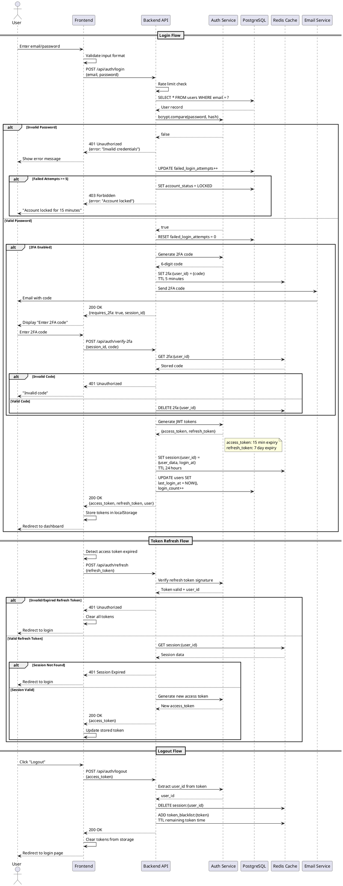

# Sequence Diagram - Authentication

## Purpose
Complete authentication flow including login with 2FA, token management, refresh, and logout.

## PlantUML Diagram

## Implementation: 17_class_domain_model_core.md (User entity with auth fields)
## Links to: 02_use_case_supplier_context.md, 03_use_case_shop_context.md (login use cases)
