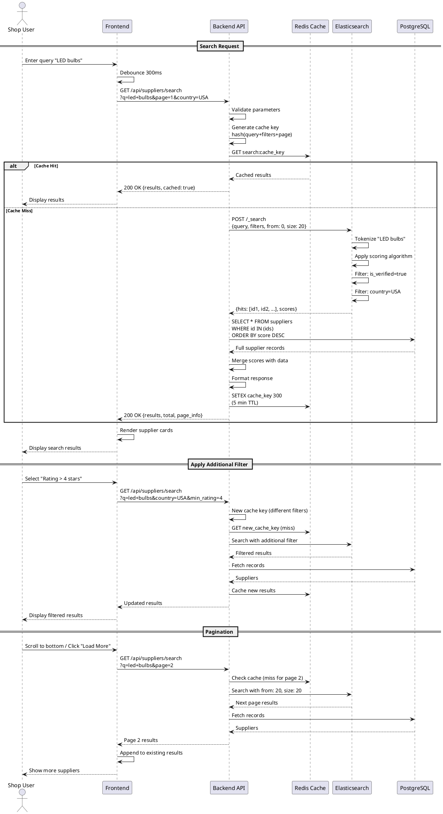

# Sequence Diagram - Supplier Search

## Purpose
Show search execution with caching, filtering, and pagination.

## PlantUML Diagram

## Links to: 07_activity_search_and_discovery.md, 03_use_case_shop_context.md
