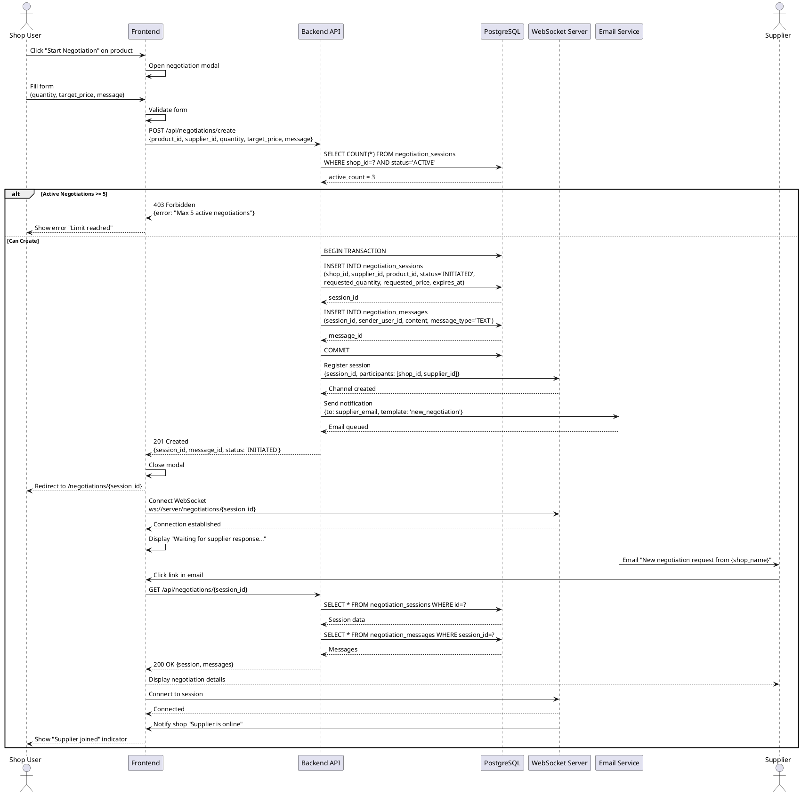

# Sequence Diagram - Negotiation Initiation

## Purpose
Show how negotiation sessions are created and WebSocket connections established.

## PlantUML Diagram

## Links to: 08_activity_negotiation_lifecycle.md, 18_class_domain_model_negotiation.md
