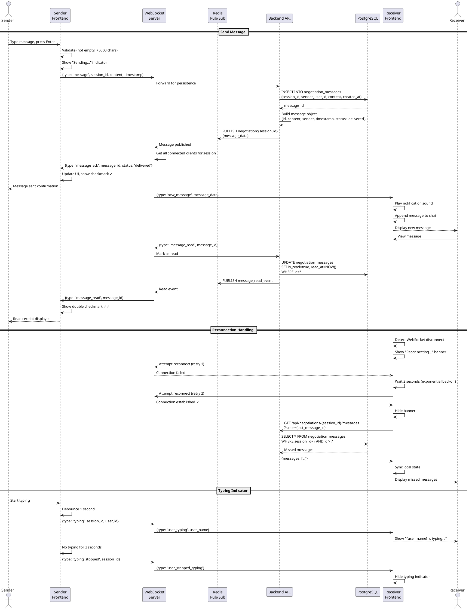

# Sequence Diagram - Real-Time Messaging

## Purpose
Show WebSocket message exchange with read receipts and reconnection.

## PlantUML Diagram

## Links to: 08_activity_negotiation_lifecycle.md, 18_class_domain_model_negotiation.md
