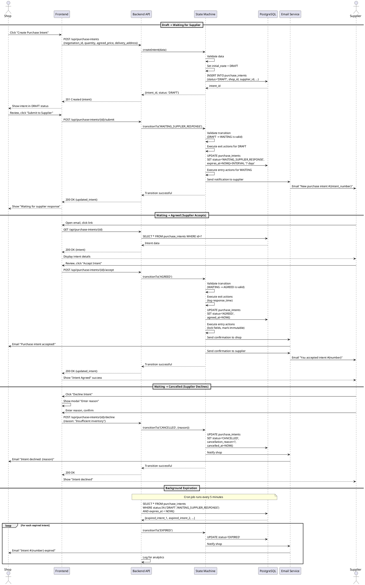

# Sequence Diagram - Purchase Intent State Transitions

## Purpose
Show state machine transitions with notifications for purchase intent lifecycle.

## PlantUML Diagram

## Links to: 09_activity_purchase_intent_creation.md, 24_state_machine_purchase_intent.md
