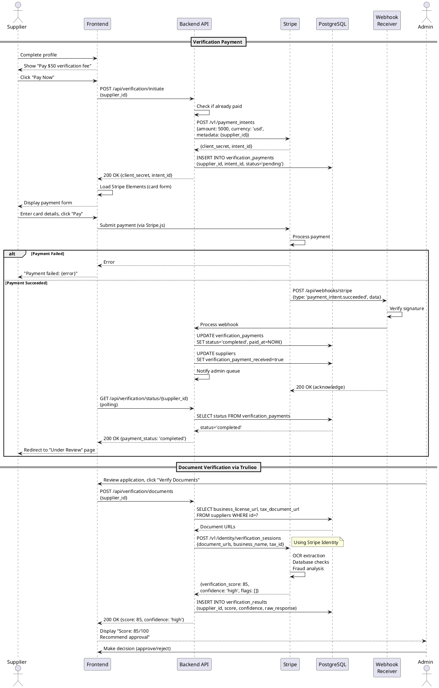

# Sequence Diagram - Payment & Document Verification

## Purpose
Show integration with external payment (Stripe) and verification (Trulioo) services.

## PlantUML Diagram

## Links to: 05_activity_supplier_onboarding.md, 17_class_domain_model_core.md
