# Class Diagram - Domain Model (Negotiation)

## Purpose
Complete data model for negotiation system including sessions, messages, and real-time communication support.

## Scope
- Negotiation session lifecycle
- Message exchange structure
- Real-time communication metadata
- Relationship with Shop, Supplier, Product entities

## PlantUML Diagram

```plantuml
@startuml class_domain_model_negotiation

' ============================================
' ENUMERATIONS
' ============================================

enum NegotiationStatus {
  INITIATED
  PENDING_SUPPLIER_RESPONSE
  ACTIVE
  AWAITING_SHOP_RESPONSE
  AWAITING_SUPPLIER_RESPONSE
  AGREED
  CLOSED_CANCELLED
  CLOSED_EXPIRED
}

enum MessageType {
  TEXT
  PRICE_OFFER
  COUNTER_OFFER
  MOQ_INQUIRY
  SHIPPING_INQUIRY
  PAYMENT_TERMS
  DELIVERY_DATE
  SPECIFICATION_QUESTION
  ATTACHMENT
  SYSTEM_MESSAGE
}

enum ParticipantRole {
  SHOP
  SUPPLIER
  SYSTEM
}

' ============================================
' MAIN ENTITIES
' ============================================

class NegotiationSession {
  -- Primary Key --
  + id: UUID <<PK>>
  
  -- Foreign Keys --
  + shop_id: UUID <<FK→Shop>> <<NOT NULL>>
  + supplier_id: UUID <<FK→Supplier>> <<NOT NULL>>
  + product_id: UUID <<FK→Product>> <<NULLABLE>>
  + created_by_user_id: UUID <<FK→User>> <<NOT NULL>>
  
  -- Status & Lifecycle --
  + status: NegotiationStatus <<NOT NULL>>
  + initiated_by: ParticipantRole <<NOT NULL>>
  + closed_reason: VARCHAR(500)
  + closed_by_user_id: UUID <<FK→User>>
  
  -- Initial Request Details --
  + requested_quantity: INTEGER
  + requested_price: NUMERIC(10,2)
  + requested_currency: VARCHAR(3) <<DEFAULT 'USD'>>
  + shipping_requirements: TEXT
  + payment_terms_request: TEXT
  + initial_message: TEXT <<NOT NULL>>
  
  -- Final Agreed Terms (if AGREED) --
  + final_agreed_price: NUMERIC(10,2)
  + final_agreed_quantity: INTEGER
  + final_shipping_terms: TEXT
  + final_payment_terms: TEXT
  + agreed_delivery_date: DATE
  
  -- Metadata --
  + total_messages: INTEGER <<DEFAULT 0>>
  + last_message_at: TIMESTAMPTZ
  + last_message_by: UUID <<FK→User>>
  + shop_unread_count: INTEGER <<DEFAULT 0>>
  + supplier_unread_count: INTEGER <<DEFAULT 0>>
  
  -- Timestamps --
  + created_at: TIMESTAMPTZ <<NOT NULL, DEFAULT NOW()>>
  + updated_at: TIMESTAMPTZ <<NOT NULL, DEFAULT NOW()>>
  + expires_at: TIMESTAMPTZ
  + closed_at: TIMESTAMPTZ
  + first_response_at: TIMESTAMPTZ
  + agreed_at: TIMESTAMPTZ
  
  -- Soft Delete --
  + deleted_at: TIMESTAMPTZ
  
  -- Methods --
  + sendMessage(userId: UUID, content: String, type: MessageType): NegotiationMessage
  + updateStatus(newStatus: NegotiationStatus, userId: UUID): void
  + close(reason: String, userId: UUID): void
  + checkExpiration(): Boolean
  + calculateResponseTime(): Integer
  + createPurchaseIntent(): PurchaseIntent
  + markMessagesAsRead(userId: UUID): void
  + getUnreadCount(userId: UUID): Integer
  + isParticipant(userId: UUID): Boolean
  + canSendMessage(userId: UUID): Boolean
}

class NegotiationMessage {
  -- Primary Key --
  + id: UUID <<PK>>
  
  -- Foreign Keys --
  + session_id: UUID <<FK→NegotiationSession>> <<NOT NULL>>
  + sender_user_id: UUID <<FK→User>> <<NOT NULL>>
  + reply_to_message_id: UUID <<FK→NegotiationMessage>> <<NULLABLE>>
  
  -- Message Content --
  + content: TEXT <<NOT NULL>>
  + message_type: MessageType <<NOT NULL, DEFAULT 'TEXT'>>
  + sender_role: ParticipantRole <<NOT NULL>>
  
  -- Structured Data (JSONB) --
  + metadata: JSONB
  -- For PRICE_OFFER: {price: 1200.50, quantity: 100, valid_until: "2024-12-31"}
  -- For MOQ_INQUIRY: {min_quantity: 50, max_quantity: 500}
  -- For SHIPPING_INQUIRY: {shipping_method: "Air", destination: "USA"}
  
  -- Attachments (JSONB Array) --
  + attachments: JSONB
  -- [{filename: "specs.pdf", url: "s3://...", size: 1024000, type: "application/pdf"}]
  
  -- Read Status --
  + is_read_by_shop: BOOLEAN <<DEFAULT FALSE>>
  + is_read_by_supplier: BOOLEAN <<DEFAULT FALSE>>
  + read_by_shop_at: TIMESTAMPTZ
  + read_by_supplier_at: TIMESTAMPTZ
  
  -- Delivery Status --
  + is_delivered: BOOLEAN <<DEFAULT FALSE>>
  + delivered_at: TIMESTAMPTZ
  
  -- Timestamps --
  + created_at: TIMESTAMPTZ <<NOT NULL, DEFAULT NOW()>>
  + updated_at: TIMESTAMPTZ <<NOT NULL, DEFAULT NOW()>>
  + deleted_at: TIMESTAMPTZ
  
  -- Methods --
  + markAsRead(userId: UUID): void
  + markAsDelivered(): void
  + getMetadata(): Object
  + hasAttachments(): Boolean
  + getAttachmentCount(): Integer
  + isSystemMessage(): Boolean
  + formatForDisplay(): String
}

class NegotiationParticipant {
  -- Primary Key --
  + id: UUID <<PK>>
  
  -- Foreign Keys --
  + session_id: UUID <<FK→NegotiationSession>> <<NOT NULL>>
  + user_id: UUID <<FK→User>> <<NOT NULL>>
  
  -- Participant Info --
  + role: ParticipantRole <<NOT NULL>>
  + joined_at: TIMESTAMPTZ <<NOT NULL, DEFAULT NOW()>>
  + last_seen_at: TIMESTAMPTZ
  + last_read_message_id: UUID <<FK→NegotiationMessage>>
  
  -- Notification Preferences --
  + email_notifications_enabled: BOOLEAN <<DEFAULT TRUE>>
  + push_notifications_enabled: BOOLEAN <<DEFAULT TRUE>>
  + muted: BOOLEAN <<DEFAULT FALSE>>
  
  -- Timestamps --
  + created_at: TIMESTAMPTZ <<NOT NULL, DEFAULT NOW()>>
  + updated_at: TIMESTAMPTZ <<NOT NULL, DEFAULT NOW()>>
  
  -- Constraints --
  <<UNIQUE (session_id, user_id)>>
  
  -- Methods --
  + updateLastSeen(): void
  + updateLastRead(messageId: UUID): void
  + mute(): void
  + unmute(): void
}

class NegotiationEvent {
  -- Primary Key --
  + id: UUID <<PK>>
  
  -- Foreign Keys --
  + session_id: UUID <<FK→NegotiationSession>> <<NOT NULL>>
  + user_id: UUID <<FK→User>> <<NULLABLE>>
  
  -- Event Details --
  + event_type: VARCHAR(100) <<NOT NULL>>
  -- Examples: 'STATUS_CHANGED', 'MESSAGE_SENT', 'TERMS_UPDATED', 'SESSION_CLOSED'
  
  + old_value: JSONB
  + new_value: JSONB
  + description: TEXT
  
  -- Timestamps --
  + created_at: TIMESTAMPTZ <<NOT NULL, DEFAULT NOW()>>
  
  -- Methods --
  + static log(sessionId: UUID, eventType: String, data: Object): void
  + getAuditTrail(sessionId: UUID): NegotiationEvent[]
}

' ============================================
' RELATIONSHIPS
' ============================================

' From external entities
Shop "1" --> "0..*" NegotiationSession : initiates
Supplier "1" --> "0..*" NegotiationSession : receives
Product "1" --> "0..*" NegotiationSession : concerns
User "1" --> "0..*" NegotiationSession : creates

' Session to Messages (Composition)
NegotiationSession "1" *--> "0..*" NegotiationMessage : contains

' Session to Participants (Composition)
NegotiationSession "1" *--> "2..*" NegotiationParticipant : has

' Session to Events (Composition)
NegotiationSession "1" *--> "0..*" NegotiationEvent : tracks

' Message to User
User "1" --> "0..*" NegotiationMessage : sends

' Message to Message (Self-reference for replies)
NegotiationMessage "0..1" <-- "0..*" NegotiationMessage : replies to

' Participant to User
User "1" --> "0..*" NegotiationParticipant : participates as

' Event to User
User "0..1" --> "0..*" NegotiationEvent : triggers

' ============================================
' INDEXES
' ============================================

note right of NegotiationSession
  **Indexes:**
  - idx_negotiation_shop (shop_id)
  - idx_negotiation_supplier (supplier_id)
  - idx_negotiation_product (product_id)
  - idx_negotiation_status (status)
  - idx_negotiation_created (created_at DESC)
  - idx_negotiation_expires (expires_at) WHERE status IN (...)
  - idx_negotiation_active (status, updated_at) WHERE status = 'ACTIVE'
  
  **Composite Indexes:**
  - idx_shop_status (shop_id, status)
  - idx_supplier_status (supplier_id, status)
end note

note right of NegotiationMessage
  **Indexes:**
  - idx_message_session (session_id, created_at DESC)
  - idx_message_sender (sender_user_id)
  - idx_message_unread_shop (session_id, is_read_by_shop) 
    WHERE is_read_by_shop = FALSE
  - idx_message_unread_supplier (session_id, is_read_by_supplier)
    WHERE is_read_by_supplier = FALSE
  - idx_message_type (message_type)
  
  **Full-Text Search:**
  - idx_message_content_fts (to_tsvector('english', content))
    USING GIN
end note

note right of NegotiationParticipant
  **Indexes:**
  - idx_participant_session (session_id)
  - idx_participant_user (user_id)
  - idx_participant_last_seen (last_seen_at)
end note

note right of NegotiationEvent
  **Indexes:**
  - idx_event_session (session_id, created_at DESC)
  - idx_event_user (user_id)
  - idx_event_type (event_type)
end note

' ============================================
' CONSTRAINTS
' ============================================

note left of NegotiationSession
  **Constraints:**
  - CHECK (requested_quantity > 0)
  - CHECK (requested_price >= 0)
  - CHECK (final_agreed_quantity > 0 OR final_agreed_quantity IS NULL)
  - CHECK (final_agreed_price >= 0 OR final_agreed_price IS NULL)
  - CHECK (expires_at > created_at)
  - CHECK (status IN enum values)
  
  **Triggers:**
  - BEFORE UPDATE: auto-update updated_at
  - AFTER INSERT message: increment total_messages
  - AFTER UPDATE status: log to NegotiationEvent
end note

note left of NegotiationMessage
  **Constraints:**
  - CHECK (content IS NOT NULL AND length(content) > 0)
  - CHECK (length(content) <= 5000)
  - CHECK (message_type IN enum values)
  
  **Triggers:**
  - AFTER INSERT: update session.last_message_at
  - AFTER INSERT: update session.total_messages
  - AFTER INSERT: increment unread count for recipient
end note

@enduml
```



## Key Design Decisions

### 1. Dual Unread Counters
- **Per-Participant Tracking**: `shop_unread_count` and `supplier_unread_count`
- **Performance**: Denormalized for fast queries (no COUNT(*) needed)
- **Maintained by Triggers**: Auto-increment on message insert, reset on read
- **UI Benefit**: Show badge counts without expensive queries

### 2. Message Metadata (JSONB)
Flexible structure for different message types:
```json
// PRICE_OFFER
{
  "price": 1200.50,
  "quantity": 100,
  "currency": "USD",
  "valid_until": "2024-12-31",
  "includes_shipping": false
}

// MOQ_INQUIRY
{
  "min_quantity": 50,
  "max_quantity": 500,
  "bulk_discount_available": true
}

// SHIPPING_INQUIRY
{
  "shipping_method": "Air Freight",
  "destination_country": "USA",
  "destination_city": "New York",
  "estimated_delivery_days": 7
}
```

### 3. Participant Model
- **Explicit Tracking**: Who's in the negotiation
- **Last Seen**: Show "Active now" / "Last seen 2 hours ago"
- **Last Read**: Sync read receipts across devices
- **Notification Preferences**: Per-negotiation muting

### 4. Event Logging
Complete audit trail of all changes:
- Status changes
- Terms updates
- Messages sent
- Participants joined/left
- Session closed

### 5. Reply Threading
- **reply_to_message_id**: Support threaded conversations
- **UI Benefit**: Quote/reference previous messages
- **Context**: Keep track of which message is being answered

## Business Rules

1. **Active Session Limit**: Max 5 active negotiations per shop (enforced at application level)
2. **Message Length**: Max 5,000 characters per message
3. **Attachment Size**: Max 10MB total per session
4. **Expiration**: 30 days from last activity
5. **Soft Delete**: Messages never hard-deleted (compliance)
6. **Read Receipts**: Real-time via WebSocket
7. **System Messages**: Auto-generated for status changes

## Database Schema (PostgreSQL)

```sql
-- Negotiation Sessions Table
CREATE TABLE negotiation_sessions (
  id UUID PRIMARY KEY DEFAULT gen_random_uuid(),
  shop_id UUID NOT NULL REFERENCES shops(id),
  supplier_id UUID NOT NULL REFERENCES suppliers(id),
  product_id UUID REFERENCES products(id),
  created_by_user_id UUID NOT NULL REFERENCES users(id),
  
  status VARCHAR(50) NOT NULL DEFAULT 'INITIATED',
  initiated_by VARCHAR(20) NOT NULL,
  closed_reason VARCHAR(500),
  closed_by_user_id UUID REFERENCES users(id),
  
  requested_quantity INTEGER,
  requested_price NUMERIC(10,2),
  requested_currency VARCHAR(3) DEFAULT 'USD',
  shipping_requirements TEXT,
  payment_terms_request TEXT,
  initial_message TEXT NOT NULL,
  
  final_agreed_price NUMERIC(10,2),
  final_agreed_quantity INTEGER,
  final_shipping_terms TEXT,
  final_payment_terms TEXT,
  agreed_delivery_date DATE,
  
  total_messages INTEGER DEFAULT 0,
  last_message_at TIMESTAMPTZ,
  last_message_by UUID REFERENCES users(id),
  shop_unread_count INTEGER DEFAULT 0,
  supplier_unread_count INTEGER DEFAULT 0,
  
  created_at TIMESTAMPTZ NOT NULL DEFAULT NOW(),
  updated_at TIMESTAMPTZ NOT NULL DEFAULT NOW(),
  expires_at TIMESTAMPTZ,
  closed_at TIMESTAMPTZ,
  first_response_at TIMESTAMPTZ,
  agreed_at TIMESTAMPTZ,
  deleted_at TIMESTAMPTZ,
  
  CONSTRAINT chk_requested_quantity_positive CHECK (requested_quantity > 0),
  CONSTRAINT chk_requested_price_nonnegative CHECK (requested_price >= 0),
  CONSTRAINT chk_expires_after_created CHECK (expires_at > created_at)
);

-- Negotiation Messages Table
CREATE TABLE negotiation_messages (
  id UUID PRIMARY KEY DEFAULT gen_random_uuid(),
  session_id UUID NOT NULL REFERENCES negotiation_sessions(id) ON DELETE CASCADE,
  sender_user_id UUID NOT NULL REFERENCES users(id),
  reply_to_message_id UUID REFERENCES negotiation_messages(id),
  
  content TEXT NOT NULL,
  message_type VARCHAR(50) NOT NULL DEFAULT 'TEXT',
  sender_role VARCHAR(20) NOT NULL,
  
  metadata JSONB,
  attachments JSONB,
  
  is_read_by_shop BOOLEAN DEFAULT FALSE,
  is_read_by_supplier BOOLEAN DEFAULT FALSE,
  read_by_shop_at TIMESTAMPTZ,
  read_by_supplier_at TIMESTAMPTZ,
  
  is_delivered BOOLEAN DEFAULT FALSE,
  delivered_at TIMESTAMPTZ,
  
  created_at TIMESTAMPTZ NOT NULL DEFAULT NOW(),
  updated_at TIMESTAMPTZ NOT NULL DEFAULT NOW(),
  deleted_at TIMESTAMPTZ,
  
  CONSTRAINT chk_content_not_empty CHECK (length(content) > 0),
  CONSTRAINT chk_content_max_length CHECK (length(content) <= 5000)
);

-- Negotiation Participants Table
CREATE TABLE negotiation_participants (
  id UUID PRIMARY KEY DEFAULT gen_random_uuid(),
  session_id UUID NOT NULL REFERENCES negotiation_sessions(id) ON DELETE CASCADE,
  user_id UUID NOT NULL REFERENCES users(id),
  
  role VARCHAR(20) NOT NULL,
  joined_at TIMESTAMPTZ NOT NULL DEFAULT NOW(),
  last_seen_at TIMESTAMPTZ,
  last_read_message_id UUID REFERENCES negotiation_messages(id),
  
  email_notifications_enabled BOOLEAN DEFAULT TRUE,
  push_notifications_enabled BOOLEAN DEFAULT TRUE,
  muted BOOLEAN DEFAULT FALSE,
  
  created_at TIMESTAMPTZ NOT NULL DEFAULT NOW(),
  updated_at TIMESTAMPTZ NOT NULL DEFAULT NOW(),
  
  CONSTRAINT uq_session_user UNIQUE (session_id, user_id)
);

-- Negotiation Events Table (Audit Log)
CREATE TABLE negotiation_events (
  id UUID PRIMARY KEY DEFAULT gen_random_uuid(),
  session_id UUID NOT NULL REFERENCES negotiation_sessions(id) ON DELETE CASCADE,
  user_id UUID REFERENCES users(id),
  
  event_type VARCHAR(100) NOT NULL,
  old_value JSONB,
  new_value JSONB,
  description TEXT,
  
  created_at TIMESTAMPTZ NOT NULL DEFAULT NOW()
);

-- Indexes
CREATE INDEX idx_negotiation_shop ON negotiation_sessions(shop_id);
CREATE INDEX idx_negotiation_supplier ON negotiation_sessions(supplier_id);
CREATE INDEX idx_negotiation_status ON negotiation_sessions(status);
CREATE INDEX idx_negotiation_active ON negotiation_sessions(status, updated_at) 
  WHERE status = 'ACTIVE';

CREATE INDEX idx_message_session ON negotiation_messages(session_id, created_at DESC);
CREATE INDEX idx_message_unread_shop ON negotiation_messages(session_id, is_read_by_shop)
  WHERE is_read_by_shop = FALSE;
CREATE INDEX idx_message_content_fts ON negotiation_messages 
  USING GIN(to_tsvector('english', content));

CREATE INDEX idx_participant_session ON negotiation_participants(session_id);
CREATE INDEX idx_event_session ON negotiation_events(session_id, created_at DESC);

-- Triggers
CREATE TRIGGER trg_update_session_timestamp
  BEFORE UPDATE ON negotiation_sessions
  FOR EACH ROW EXECUTE FUNCTION update_timestamp();

CREATE TRIGGER trg_increment_message_count
  AFTER INSERT ON negotiation_messages
  FOR EACH ROW EXECUTE FUNCTION increment_session_message_count();
```

## Related Diagrams
- **08_activity_negotiation_lifecycle.md**: Negotiation workflow
- **13_sequence_negotiation_initiation.md**: Session creation sequence
- **14_sequence_real_time_messaging.md**: Message exchange sequence
- **23_state_machine_negotiation_session.md**: Session state machine
- **17_class_domain_model_core.md**: Related User, Shop, Supplier entities

## Implementation Notes

### WebSocket Message Format
```typescript
interface WebSocketMessage {
  type: 'new_message' | 'message_read' | 'typing' | 'user_joined' | 'user_left';
  sessionId: string;
  messageId?: string;
  userId: string;
  data?: any;
  timestamp: string;
}
```

### Unread Count Maintenance
```sql
-- Trigger function to increment unread count
CREATE OR REPLACE FUNCTION increment_unread_count()
RETURNS TRIGGER AS $$
BEGIN
  IF NEW.sender_role = 'SHOP' THEN
    UPDATE negotiation_sessions 
    SET supplier_unread_count = supplier_unread_count + 1
    WHERE id = NEW.session_id;
  ELSE
    UPDATE negotiation_sessions 
    SET shop_unread_count = shop_unread_count + 1
    WHERE id = NEW.session_id;
  END IF;
  RETURN NEW;
END;
$$ LANGUAGE plpgsql;

CREATE TRIGGER trg_increment_unread
  AFTER INSERT ON negotiation_messages
  FOR EACH ROW EXECUTE FUNCTION increment_unread_count();
```

## Performance Considerations
- **Message Pagination**: Load 50 messages at a time
- **Unread Badges**: Cached in Redis for 1 minute
- **Full-Text Search**: Index for searching message history
- **Partitioning**: Consider partitioning messages by created_at for large scale
