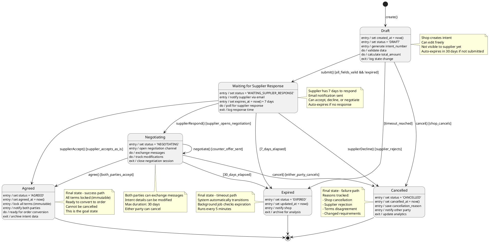

# State Machine Diagram - Purchase Intent Lifecycle

## Purpose
Complete state machine modeling the entire lifecycle of a Purchase Intent, from creation through approval/rejection to expiration. Shows all valid state transitions, events, guards, and actions.

## Scope
- All Purchase Intent states
- Valid transitions between states
- Events triggering transitions
- Guard conditions
- Entry/exit/do actions
- Timeout handling
- Error scenarios

## PlantUML Diagram



## State Descriptions

### 1. Draft
**Purpose**: Initial state where shop creates and prepares purchase intent

**Entry Actions**:
- Generate unique `intent_number` (e.g., PI-2024-001234)
- Set `status = 'DRAFT'`
- Initialize `created_at` timestamp
- Set `expires_at = created_at + 30 days` (draft expiration)

**During State**:
- Shop can modify all fields (quantity, price, terms, delivery address)
- Validation runs on each save
- Total amount automatically calculated
- Not visible to supplier

**Exit Actions**:
- Log state transition
- Clear any draft warnings

**Valid Transitions**:
- ✅ **To WaitingSupplier**: Shop submits → `submit()`
- ✅ **To Cancelled**: Shop abandons intent → `cancel()`
- ✅ **To Expired**: 30 days pass without submission → automatic

### 2. Waiting for Supplier Response
**Purpose**: Intent submitted to supplier, awaiting their decision

**Entry Actions**:
- Set `status = 'WAITING_SUPPLIER_RESPONSE'`
- Send email notification to supplier
- Set `expires_at = now() + 7 days`
- Update `updated_at` timestamp

**During State**:
- System polls for supplier action (or uses WebSocket)
- Shop cannot modify (locked for supplier review)
- Supplier reviews intent details
- Response timer ticking

**Exit Actions**:
- Calculate and store supplier `response_time_hours`
- Update supplier performance metrics

**Valid Transitions**:
- ✅ **To Negotiating**: Supplier opens negotiation → `supplierRespond()`
- ✅ **To Agreed**: Supplier accepts as-is → `supplierAccept()`
- ✅ **To Cancelled**: Supplier declines → `supplierDecline()`
- ✅ **To Expired**: 7 days with no response → automatic

### 3. Negotiating
**Purpose**: Active back-and-forth negotiation between shop and supplier

**Entry Actions**:
- Set `status = 'NEGOTIATING'`
- Create/link `negotiation_session_id`
- Open real-time messaging channel
- Set negotiation expiration (30 days from negotiation start)

**During State**:
- Both parties exchange messages
- Intent fields can be modified by either party
- Counter-offers tracked
- Message history maintained
- Real-time updates via WebSocket

**Exit Actions**:
- Close negotiation session
- Archive message history
- Finalize agreed terms (if agreed)

**Valid Transitions**:
- ✅ **To Negotiating (self-loop)**: Counter-offer → `negotiate()`
- ✅ **To Agreed**: Both accept final terms → `agree()`
- ✅ **To Cancelled**: Either party cancels → `cancel()`
- ✅ **To Expired**: 30 days of negotiation → automatic

**Special Behavior**:
- Self-transition on counter-offer (stays in Negotiating)
- Each modification creates a new version (audit trail)

### 4. Agreed
**Purpose**: Final successful state - both parties agreed to terms

**Entry Actions**:
- Set `status = 'AGREED'`
- Set `agreed_at = now()`
- Lock all fields (immutable)
- Send confirmation emails to both parties
- Generate PDF summary of agreed terms

**During State**:
- Intent is read-only
- Can be converted to formal order (separate workflow)
- Both parties can download agreement PDF
- Analytics updated (successful negotiation)

**Exit Actions**:
- Archive to historical records
- Update success rate metrics

**Valid Transitions**:
- ✅ **To [Final State]**: No transitions out
- This is a terminal success state

**Notes**:
- Cannot be cancelled once agreed
- Represents binding commitment (subject to ToS)
- Foundation for formal purchase order

### 5. Cancelled
**Purpose**: Final state for intents that were abandoned or rejected

**Entry Actions**:
- Set `status = 'CANCELLED'`
- Set `cancelled_at = now()`
- Store `cancellation_reason` (required)
- Notify other party
- Tag cancellation source (shop/supplier/system)

**During State**:
- Read-only
- Visible in history for learning
- Can be referenced for re-negotiation

**Exit Actions**:
- Update cancellation rate metrics
- Feed data to analytics pipeline

**Valid Transitions**:
- ✅ **To [Final State]**: No transitions out
- This is a terminal failure state

**Cancellation Reasons** (examples):
- "Shop changed requirements"
- "Supplier cannot meet MOQ"
- "Price too high"
- "Delivery timeline unacceptable"
- "Found alternative supplier"

### 6. Expired
**Purpose**: Final state for intents that timed out

**Entry Actions**:
- Set `status = 'EXPIRED'`
- Set `updated_at = now()`
- Send expiration notice to shop
- Log expiration event

**During State**:
- Read-only
- Visible in history
- Can be cloned to create new intent

**Exit Actions**:
- Archive to cold storage (after 90 days)
- Update timeout metrics

**Valid Transitions**:
- ✅ **To [Final State]**: No transitions out
- This is a terminal timeout state

**Expiration Triggers**:
- Draft not submitted in 30 days
- Waiting for supplier >7 days without response
- Negotiating >30 days without agreement

## Events & Guards

### Events

| Event | Source | Description |
|-------|--------|-------------|
| `create()` | Shop | Shop creates new purchase intent |
| `submit()` | Shop | Shop submits intent to supplier |
| `cancel()` | Shop/Supplier | Either party cancels |
| `supplierRespond()` | Supplier | Supplier opens negotiation |
| `supplierAccept()` | Supplier | Supplier accepts as-is |
| `supplierDecline()` | Supplier | Supplier rejects intent |
| `negotiate()` | Shop/Supplier | Send counter-offer |
| `agree()` | Shop/Supplier | Accept final terms |
| `[timeout]` | System | Background job checks expiration |

### Guard Conditions

| Guard | Condition | Purpose |
|-------|-----------|---------|
| `all_fields_valid` | All required fields populated, quantities positive, prices valid | Prevent invalid submissions |
| `!expired` | `current_time < expires_at` | Prevent action on expired intents |
| `supplier_opens_negotiation` | Supplier clicks "Negotiate" button | Distinguish negotiate from accept |
| `supplier_accepts_as_is` | Supplier clicks "Accept" without changes | Fast-track approval |
| `supplier_rejects` | Supplier clicks "Decline" with reason | Formal rejection |
| `counter_offer_sent` | Either party modifies terms | Track negotiation rounds |
| `both_parties_accept` | Final terms accepted by both | Mutual agreement |
| `either_party_cancels` | Cancel button clicked | Allow exit from negotiation |
| `7_days_elapsed` | `current_time > expires_at` | Supplier response timeout |
| `30_days_elapsed` | `current_time > expires_at` | Negotiation timeout |

## Business Rules

### Timeouts
1. **Draft Expiration**: 30 days from creation
2. **Supplier Response**: 7 days from submission
3. **Negotiation Expiration**: 30 days from negotiation start
4. **Grace Period**: None - hard cutoff for automated transitions

### Validation Rules
- **Submit Transition**: Requires `quantity > 0`, `agreed_unit_price > 0`, `supplier_id` set, `product_id` set
- **Agree Transition**: Requires both parties to explicitly confirm (not automatic)
- **Cancel Transition**: Requires `cancellation_reason` (min 10 characters)

### Immutability
- **Agreed State**: All fields frozen, cannot be modified
- **Cancelled/Expired**: Read-only, can only view

### Notifications
- **Email**: Sent on entry to WaitingSupplier, Negotiating, Agreed, Cancelled, Expired
- **In-App**: Real-time notifications for state changes
- **WebSocket**: Push notifications for immediate updates

## State Transition Matrix

| From ↓ / To → | Draft | Waiting | Negotiating | Agreed | Cancelled | Expired |
|---------------|-------|---------|-------------|--------|-----------|---------|
| **Draft** | - | ✅ submit | ❌ | ❌ | ✅ cancel | ✅ timeout |
| **Waiting** | ❌ | - | ✅ respond | ✅ accept | ✅ decline | ✅ timeout |
| **Negotiating** | ❌ | ❌ | ✅ negotiate | ✅ agree | ✅ cancel | ✅ timeout |
| **Agreed** | ❌ | ❌ | ❌ | - | ❌ | ❌ |
| **Cancelled** | ❌ | ❌ | ❌ | ❌ | - | ❌ |
| **Expired** | ❌ | ❌ | ❌ | ❌ | ❌ | - |

✅ = Valid transition  
❌ = Invalid transition  
\- = N/A (same state)

## Implementation Details

### Database Schema

```sql
CREATE TYPE purchase_intent_status AS ENUM (
  'DRAFT',
  'WAITING_SUPPLIER_RESPONSE',
  'NEGOTIATING',
  'AGREED',
  'CANCELLED',
  'EXPIRED'
);

ALTER TABLE purchase_intents ADD COLUMN status purchase_intent_status NOT NULL;
ALTER TABLE purchase_intents ADD CONSTRAINT check_status_transitions 
  CHECK (
    -- Add custom transition validation if needed
    status IN ('DRAFT', 'WAITING_SUPPLIER_RESPONSE', 'NEGOTIATING', 'AGREED', 'CANCELLED', 'EXPIRED')
  );
```

### State Transition Function

```typescript
class PurchaseIntent {
  async transitionTo(newState: PurchaseIntentStatus, event: string, actor: User): Promise<void> {
    const validTransition = this.isValidTransition(this.status, newState);
    if (!validTransition) {
      throw new InvalidStateTransitionError(
        `Cannot transition from ${this.status} to ${newState}`
      );
    }
    
    // Execute exit actions for current state
    await this.executeExitActions(this.status);
    
    // Update state
    const oldStatus = this.status;
    this.status = newState;
    this.updated_at = new Date();
    
    // Execute entry actions for new state
    await this.executeEntryActions(newState, event, actor);
    
    // Log state transition
    await this.logStateTransition(oldStatus, newState, event, actor);
    
    // Save to database
    await this.save();
    
    // Emit domain event
    await this.emitStateChangeEvent(newState);
  }
  
  private isValidTransition(from: PurchaseIntentStatus, to: PurchaseIntentStatus): boolean {
    const validTransitions = {
      DRAFT: ['WAITING_SUPPLIER_RESPONSE', 'CANCELLED', 'EXPIRED'],
      WAITING_SUPPLIER_RESPONSE: ['NEGOTIATING', 'AGREED', 'CANCELLED', 'EXPIRED'],
      NEGOTIATING: ['NEGOTIATING', 'AGREED', 'CANCELLED', 'EXPIRED'],
      AGREED: [],
      CANCELLED: [],
      EXPIRED: []
    };
    
    return validTransitions[from].includes(to);
  }
}
```

### Background Job for Expiration

```typescript
// Cron job runs every 5 minutes
async function checkPurchaseIntentExpirations() {
  const now = new Date();
  
  // Find expired drafts (30 days)
  const expiredDrafts = await PurchaseIntent.find({
    status: 'DRAFT',
    expires_at: { $lt: now }
  });
  
  for (const intent of expiredDrafts) {
    await intent.transitionTo('EXPIRED', 'timeout', SystemUser);
  }
  
  // Find expired waiting intents (7 days)
  const expiredWaiting = await PurchaseIntent.find({
    status: 'WAITING_SUPPLIER_RESPONSE',
    expires_at: { $lt: now }
  });
  
  for (const intent of expiredWaiting) {
    await intent.transitionTo('EXPIRED', 'timeout', SystemUser);
  }
  
  // Find expired negotiations (30 days)
  const expiredNegotiating = await PurchaseIntent.find({
    status: 'NEGOTIATING',
    expires_at: { $lt: now }
  });
  
  for (const intent of expiredNegotiating) {
    await intent.transitionTo('EXPIRED', 'timeout', SystemUser);
  }
}
```

## Metrics & Analytics

### Key Metrics
- **Conversion Rate**: (Agreed / (Agreed + Cancelled + Expired)) * 100
- **Average Time to Agreed**: Mean duration from Draft to Agreed
- **Expiration Rate**: Expired / Total
- **Cancellation Rate**: Cancelled / Total
- **Supplier Response Time**: Median time from WaitingSupplier entry to transition

### Dashboards
- **Shop View**: Active intents by status, success rate, avg negotiation time
- **Supplier View**: Pending responses, response time performance
- **Admin View**: System-wide conversion funnel, bottleneck analysis

## Related Diagrams
- **19_class_domain_model_transaction.md**: Purchase Intent entity definition
- **09_activity_purchase_intent_creation.md**: Creation workflow
- **15_sequence_purchase_intent_flow.md**: State transition sequences

## Testing Strategy

### Unit Tests
- Test each valid transition
- Test invalid transitions throw errors
- Test guard conditions
- Test entry/exit/do actions

### Integration Tests
- Test email notifications sent on state changes
- Test expiration background job
- Test WebSocket events emitted

### E2E Tests
- Complete flow: Draft → WaitingSupplier → Negotiating → Agreed
- Timeout scenarios: Draft → Expired, WaitingSupplier → Expired
- Cancellation scenarios: All cancellable states → Cancelled

## Notes
- State machine enforces business rules at model level
- Invalid transitions prevented by code, not just UI
- All transitions logged for audit and analytics
- Background jobs handle timeouts reliably
- WebSocket enables real-time state updates for users
